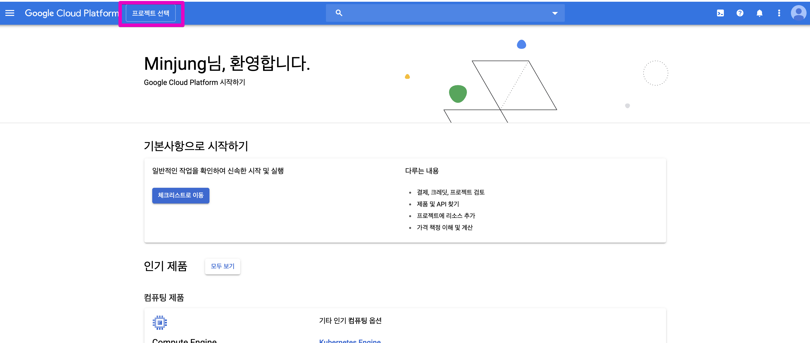
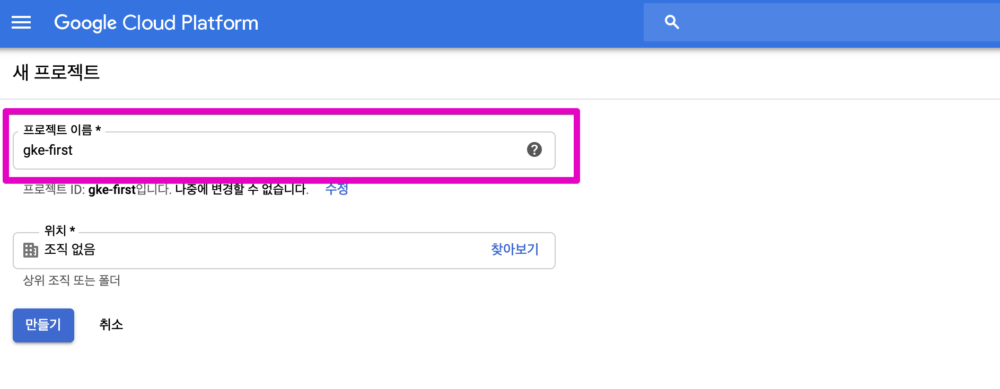
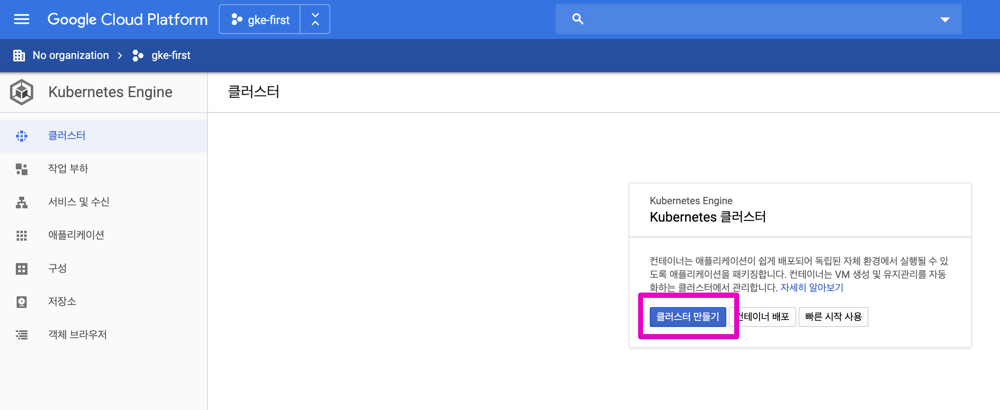
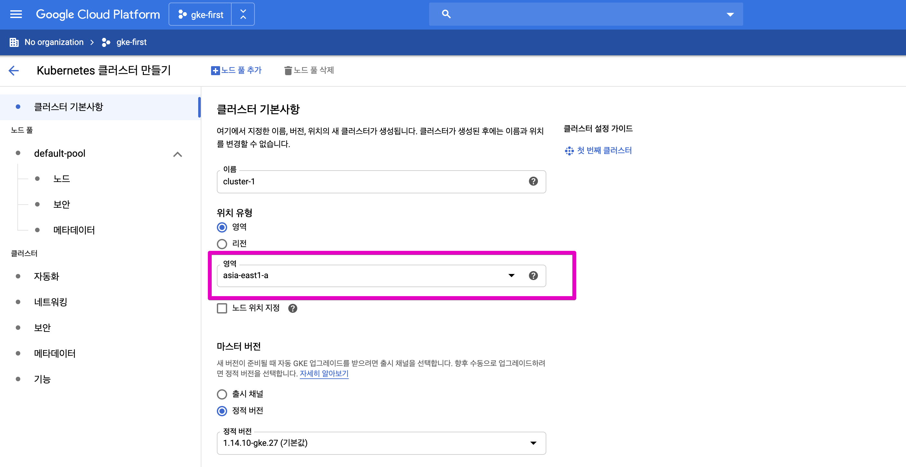
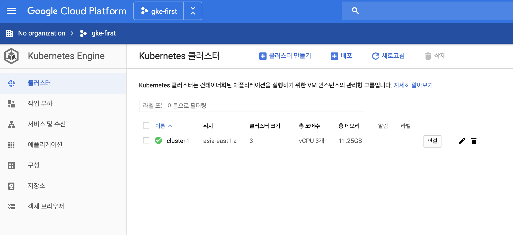
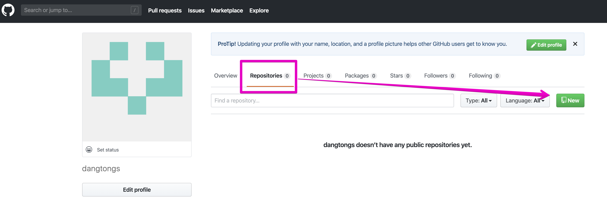
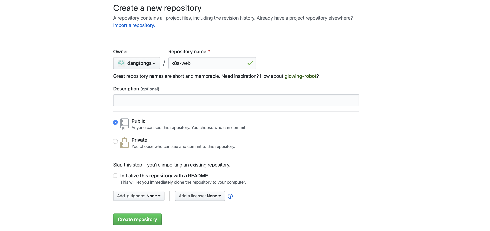

# Learning Kubernetes

[toc]

## 3. 도커 기본 다지기


### 3.1 도커 설치하기


#### 3.1.1 Ubuntu 설치

```{bash}
sudo apt-get update
sudo apt-get install docker.io
sudo ln -sf /usr/bin/docker.io /usr/local/bin/docker
```

> 우분투 패키지 메니저는 apt-get , apt-cache, apt 가 있습니다. 모두 동일한 명령어라고 보면 되지만, apt 를 쓸경우 일단 글자수가 적고, 출력 Output 에 색상이 추가되어 좀더 예쁘게 보입니다.


#### 3.1.2 CentOS 6

```{bash}
sudo yum install http://dl.fedoraproject.org/pub/epel/6/x86_64/epel-release-6-8.noarch.rpm
sudo yum install docker-io   
```


#### 3.1.3 CentOS 7 

```{bash}
sudo yum install docker
sudo service docker start
sudo chkconfig docker on # 부팅시에 자동 스타트업
```


### 3.2 도커 기본 명령어


#### 3.2.1 도커 hub 사용을 위한 계정생성

```{bash}
sudo docker login
```

> [docker hub](https://hub.docker.com/) (hub.docker.dom) 에 가입 후 명령어를 실행 해야 로그인이 가능 합니다.


#### 3.2.2 도커 이미지 검색

search 명령으로 nginx 를 검색해 봅니다.

```{bash}
sudo docker search nginx
```


#### 3.2.3 도커 이미지 다운로드

]

nodejs 이미지를 설치해봅니다. 최신 안정버전인 12.14 버전을 설치 합니다.

```{bash}
sudo docker pull nodejs:latest    # 최신버전 다운로드
sudo docker pull nodejs:12.14.0   # 특정버전 다운로드 
sudo docker pull -a nodejs        # 모든버전 다운로드
```


#### 3.2.4 도커 이미지 목록 보기

```{bash}
docker image list
docker image ls
docker images
```


### 3.3 도커 이미지 생성 하기


#### 3.3.1 서비스를 위한 Application 코드 작성

hostname_finder 라는 폴더를 만들고 그 아래 main.go 및 Dockerfiles 2개 파일을 작성 합니다.

먼저 vi 또는 gedit 를 실행해서 아래 파일을 main.go 라는 이름 으로 작성 합니다.

```{go}
package main

import (
	"fmt"
	"os"
	"log"
	"net/http"
)
func handler(w http.ResponseWriter, r *http.Request){
	name, err := os.Hostname()
	if err != nil {
		panic(err)
	}

	fmt.Fprintln(w,"hostname:", name)
}
func main() {
  fmt.Fprintln(os.Stdout,"Starting GoApp Server......")
	http.HandleFunc("/",handler)
	log.Fatal(http.ListenAndServe(":8080",nil))
}
```


#### 3.3.2 이미지 생성을 위한 Dockerfile 작성

```{dockerfile}
FROM golang:1.11-alpine AS build

WORKDIR /src/
COPY main.go go.* /src/
RUN CGO_ENABLED=0 go build -o /bin/demo

FROM scratch
COPY --from=build /bin/demo /bin/demo
ENTRYPOINT ["/bin/demo"]
```


#### 3.3.3 컨테이너 이미지 생성

hostname_finder 라는 폴더 안에서 아래 명령어를 실행 합니다.

```{bash}
docker build -t goapp .
```

>  . 은 현재 디렉토리서 Dockerfile 참조해서 first-container 라는 이미지를 생성 합니다.

[출력]

```{text}
Sending build context to Docker daemon  3.072kB
Step 1/7 : FROM golang:1.11-alpine AS build
 ---> e116d2efa2ab
Step 2/7 : WORKDIR /src/
 ---> Using cachedocker 
 ---> c3210d8eb11f
Step 3/7 : COPY main.go go.* /src/
 ---> ef55118ea78c
Step 4/7 : RUN CGO_ENABLED=0 go build -o /bin/demo
 ---> Running in e557730bf11c
Removing intermediate container e557730bf11c
 ---> d55bd9bd3f81
Step 5/7 : FROM scratch
 --->
Step 6/7 : COPY --from=build /bin/demo /bin/demo
 ---> bb4b1250a05e
Step 7/7 : ENTRYPOINT ["/bin/demo"]
 ---> Running in 4419d56988aa
Removing intermediate container 4419d56988aa
 ---> 36f5c919e3b8
Successfully built 36f5c919e3b8
Successfully tagged goapp:latest
```


이미지가 생성 되었는지 명령어를 통해 확인 합니다.

```{bash}
docker images
```

[출력]

```{txt}
REPOSITORY                           TAG                 IMAGE ID            CREATED              SIZE
<none>                               <none>              d55bd9bd3f81        About a minute ago   325MB
goapp                              latest              36f5c919e3b8        About a minute ago   6.51MB
<none>                               <none>              1c688e9c7e3c        3 days ago           325MB
<none>                               <none>              9b60c66a5b82        3 days ago           6.51MB
<none>                               <none>              7fc44021a96f        3 days ago           325MB
<none>                               <none>              2caa0c2ac791        3 days ago           325MB
<none>                               <none>              c46d81105b65        3 days ago           6.51MB
<none>                               <none>              2d78705fb4ae        3 days ago           312MB
```


###  3.4 도커 컨테이너 시작 및 서비스 확인


#### 3.4.1 도커 컨테이너 시작

```{bash}
docker run --name goapp-project -p 8080:8080 -d goapp
docker run -it --name goapp-project -p 8080:8080 -d goapp /bin/bash   
```

>--name : 실행한 도커 컨테이너의 이름 지정
>
>-p : 포트 맵핑 정보 localhost 와 컨테이너 포트를 맵핑 합니다.
>
>-d : Docker 컨테이너를 백그라운드로 수행하고 컨테이너 ID를 출력 합니다.
>
>-i : STDIN 계속 interactive 모드로 유지


#### 3.4.2 도커 컨테이스 서비스 확인

curl 명령어를 통해 정상적인 서비스 수행 여부를 확인 합니다.

```{bash}
curl localhost:8080
```

[출력]

```{txt}
hostname: 96fc3a5eb914
```


#### 3.4.3 도커 프로세서 확인

```{bash}
docker ps
```

**[출력]**

```{txt}
CONTAINER ID        IMAGE                   COMMAND                  CREATED             STATUS              PORTS                    NAMES
96fc3a5eb914        goapp                   "/bin/demo"              43 seconds ago      Up 42 seconds       0.0.0.0:8080->8080/tcp   goapp-project
```


#### 3.4.4 프로세서 상세 정보 출력

```{bash}
docker inspect goapp-project
```

[출력]

```{txt}
[
    {
        "Id": "96fc3a5eb914c58ed83e088681d53a46188edeaab061ff2de0b9852e9dd276c9",
        "Created": "2020-01-10T04:32:12.269012485Z",
        "Path": "/bin/demo",
        "Args": [],
        "State": {
            "Status": "running",
            "Running": true,
            "Paused": false,
            "Restarting": false,
            "OOMKilled": false,
            "Dead": false,
            "Pid": 31285,
            "ExitCode": 0,
            "Error": "",
            "StartedAt": "2020-01-10T04:32:12.902395362Z",
            "FinishedAt": "0001-01-01T00:00:00Z"
        },
        "Image": "sha256:36f5c919e3b88f1c991eda67d96e62fe02b763182e44f19fb78b2fc055165f3d",
        "ResolvConfPath": "/var/lib/docker/containers/96fc3a5eb914c58ed83e088681d53a46188edeaab061ff2de0b9852e9dd276c9/resolv.conf",
        "HostnamePath": "/var/lib/docker/containers/96fc3a5eb914c58ed83e088681d53a46188edeaab061ff2de0b9852e9dd276c9/hostname",
        "HostsPath": "/var/lib/docker/containers/96fc3a5eb914c58ed83e088681d53a46188edeaab061ff2de0b9852e9dd276c9/hosts",
        "LogPath": "/var/lib/docker/containers/96fc3a5eb914c58ed83e088681d53a46188edeaab061ff2de0b9852e9dd276c9/96fc3a5eb914c58ed83e088681d53a46188edeaab061ff2de0b9852e9dd276c9-json.log",
```


#### 3.4.5 Docker 컨테이너 접속

```{bash}
# docker 컨테이너 접속
docker exec -it goapp-project bash

# docker 외부에서 컨테이너에 명령수행 (ls 명령 수행)
docker exec goapp-project ls
```

>  -i  또는  --interactive : STDIN을 오픈한 상태로 인터랙티브 모드상태
>
> -t  또는 --tty  : terminal 모드
>
> container 이름이 보이지 않고 ID 만 기본적으로 보입니다. 컨테이너 이름을 출력하려면 아래 명령어를 수행 하면 됩니다.
>
> docker ps --format "{{.Names}}" 


#### 3.4.6 도커 인스턴스 중단 및 삭제

```{bash}
docker stop goapp-project
docker rm goapp-project
```


### 3.5. 도커 이미지를 도커 허브에 업로드


#### 3.5.1  도커 허브양식에 맞게 tag 수정하기

```{bash}
docker tag goapp  dangtong/goapp
```

[출력]

```{text}
REPOSITORY                           TAG                 IMAGE ID            CREATED             SIZE
dangtong/goapp                       latest              12e9a84d9e23        3 days ago          6.51MB
goapp                                latest              12e9a84d9e23        3 days ago          6.51MB
```


>dangtong/firstapp 과 first-container 의 image ID 가 같은 것을 확인 할 수 있습니다.
>
>사실 하나의 이미지를 서로 다른 TAGID 로 공유 하는 것입니다. 디스크 공간이 늘어나지 않습니다.


#### 3.5.2 도커 허브에 이미지 업로드 하기

```{bash}
docker login --username dangtong
docker push dangtong/goapp
```

[출력]

```{text}
The push refers to repository [docker.io/dangtong/goapp]
cc282a374c26: Pushed
latest: digest: sha256:b18b5ff03599893a7361feda054ebe26de61a71f019dc8725bb33d87f2115968 size: 528
```


도커 허브에 로그인 하게 되면 아래와 같이 goapp 이미지가 업로드 된것을 확인 할 수 있습니다. 이제 인터넷만 연결  되면 어디서는 자신이 만든 이미지로 컨테이너를 실행 할 수 있습니다.


#### 3.5.3  도커 허브의 이미지로 컨테이너 실행

docker hub 에 있는 이미지를 로딩하여 컨테이너 생성

```{bash}
docker run --name goapp-project -p 8080:8080 -d dangtong/goapp
```

```{bash}
docker ps 
```

[출력]

```{txt}
CONTAINER ID        IMAGE                   COMMAND                  CREATED             STATUS              PORTS                    NAMES
0938068f8709        dangtong/goapp          "/bin/demo"              5 seconds ago       Up 4 seconds        0.0.0.0:8080->8080/tcp   goapp-project
```


현재 서비스에 접속하여 확인

```{bash}
curl http://localhost:8080
```

```{txt}
hostname: 0938068f8709
```


### [Exercise #1]


1. 서버 호스트명을 출력하는 node.js 프로그램을 만드세요

2. 해당 소스로 node 버전 7 기반으로 서비스 하는 Docker file을 만들고 이미지를 build 하세요

3.  tag 명령을 이용해서 docker hub 에 올릴수 있도록 이름을 바꾸세요

4. docker login 후에 docker hub 에 업로드하여 실제 업로드가 되었는지 확인하세요

  이름은 username/nodejs-app 으로 하세요

   

- node.js 프로그램

```{javascript}
const http = require('http');
const os = require('os');

console.log("Learning Kubernetes server starting...");

var handler = function(request, response) {
  console.log("Received request from " + request.connection.remoteAddress);
  response.writeHead(200);
  response.end("You've hit " + os.hostname() + "\n");
};

var www = http.createServer(handler);
www.listen(8080);
```


- Dcokerfile

```{bash}
# FROM 으로 BASE 이미지 로드
FROM node:7

# ADD 명령어로 이미지에 app.js 파일 추가
ADD app.js /app.js

# ENTRYPOINT 명령어로 node 를 실행하고 매개변수로 app.js 를 전달
ENTRYPOINT ["node", "app.js"]
```


## 4. 쿠버네티스 간단하게 맛보기

### 4.1 도커 허브 이미지로 컨테이너 생성 및 확인


- 컨테이너 생성 : run/v1 으로 수행 합니다.

  ```{bash}
  # POD 및 Replication Controller 생성 (향후 버전에서 deprecated 될 예정)
  $ kubectl run goapp-project --image=dangtong/goapp --port=8080 --generator=run/v1
  # POD 만 생성
  $ kubectl run goapp-project --image=dangtong/goapp --port=8080 --generator=run-pod/v1
  ```

  > generator 를 run/v1 으로 수행 할 경우 내부적으로 goapp-project-{random-String} 이라는 컨테이너를 만들면서 goapp-project- 이름의 replication controller  도 생기게 됩니다.

  

  - Generator 의 종류 : **run-pod/v1**  외에 모두 deprecated 될 예정

  | Resource                             | API group          | kubectl command                                   |
  | :----------------------------------- | :----------------- | :------------------------------------------------ |
  | Pod                                  | v1                 | `kubectl run --generator=run-pod/v1`              |
  | ReplicationController *(deprecated)* | v1                 | `kubectl run --generator=run/v1`                  |
  | Deployment *(deprecated)*            | extensions/v1beta1 | `kubectl run --generator=deployment/v1beta1`      |
  | Deployment *(deprecated)*            | apps/v1beta1       | `kubectl run --generator=deployment/apps.v1beta1` |
  | Job *(deprecated)*                   | batch/v1           | `kubectl run --generator=job/v1`                  |
  | CronJob *(deprecated)*               | batch/v2alpha1     | `kubectl run --generator=cronjob/v2alpha1`        |
  | CronJob *(deprecated)*               | batch/v1beta1      | `kubectl run --generator=cronjob/v1beta1`         |

  

- 컨테이너 확인

  ```{bash}
  $ kubectl get pods
  $ kubectl get rc
  ```

  ```{text}
  $ kubectl get pods
  NAME             READY   STATUS    RESTARTS   AGE
  goapp-project-bcv5q   1/1     Running   0          2m26s
  
  $ kubectl get rc
  NAME            DESIRED   CURRENT   READY   AGE
  goapp-project   1         1         1       8m58s
  ```

  > 아래 명령어를 추가적으로 수행해 보세요
  >
  > ```
  > kubectl get pods -o wide
  > kubectl describe pod goapp-project-bcv5q
  > ```


- k8s 서비스 생성

  ```{bash}
  $ kubectl expose rc goapp-project --type=LoadBalancer --name goapp-http
  ```

  ```{text}
  service/firstapp-http exposed
  ```


- 생성한 서비스 조회

  ```{bash}
  $ kubectl get services
  ```

  ```{text}
  NAME         TYPE           CLUSTER-IP      EXTERNAL-IP   PORT(S)          AGE
  goapp-http   LoadBalancer   10.96.225.172   <pending>     8080:31585/TCP   104s
  kubernetes   ClusterIP      10.96.0.1       <none>        443/TCP          14d
  ```

  

- 서비스 테스트 (여러번 수행)

  ```{bash}
  curl http://10.96.225.172:8080
  ```

  [출력]
  
  ```{text}
hostname: goapp-project-bcv5q
  hostname: goapp-project-bcv5q
  hostname: goapp-project-bcv5q
  hostname: goapp-project-bcv5q
  ```
  
  

- replication controller 를 통한 scale-out 수행

  ```{bash}
  kubectl scale rc goapp-project --replicas=3
  ```

  [출력]

  ```{txt}
  replicationcontroller/goapp-project scaled
  ```


- Scale-Out 결과 확인

  ```{bash}
  kubectl get pod
  ```

  [출력]

  ```{txt}
  NAME                  READY   STATUS    RESTARTS   AGE
  goapp-project-bcv5q   1/1     Running   0          16m
  goapp-project-c8hml   1/1     Running   0          26s
  goapp-project-r7kx5   1/1     Running   0          26s
  ```


- 서비스 테스트 (여러번 수행)

  ```{bash}
  curl http://10.96.225.172:8080
  ```

  [출력]

  ```{txt}
  NAME                  READY   STATUS    RESTARTS   AGE
  goapp-project-bcv5q   1/1     Running   0          16m
  goapp-project-c8hml   1/1     Running   0          26s
  goapp-project-r7kx5   1/1     Running   0          26s
  ```

  

- POD 삭제

Replication Controller 를 통해 생성된 POD 는 개별 POD 가 삭제 되지 않습니다. Replication Controller 자체를 삭제 해야 합니다.

```{bash}
kubectl delete rc goapp-project
```


## 5. PODS


### 5.1 POD 기본 

### 5.1 POD 설정을 yaml 파일로 가져오기

```{bash}
kubectl get pod goapp-project-bcv5q -o yaml
kubectl get po goapp-project-bcv5q -o json
```

크게 **metadata, spec, status** 항목으로 나누어 집니다.

[출력 - yaml]

```{yaml}
apiVersion: v1
kind: Pod
metadata:
  creationTimestamp: "2020-01-10T07:37:49Z"
  generateName: goapp-project-
  labels:
    run: goapp-project
  name: goapp-project-bcv5q
  namespace: default
  ownerReferences:
  - apiVersion: v1
    blockOwnerDeletion: true
    controller: true
    kind: ReplicationController
    name: goapp-project
    uid: e223237f-17e2-44f4-aaee-07e8ff4592b2
  resourceVersion: "3082141"
  selfLink: /api/v1/namespaces/default/pods/goapp-project-bcv5q
  uid: 72bebcbd-8e6e-4906-9f66-1c3821fa49ec
spec:
  containers:
  - image: dangtong/goapp
    imagePullPolicy: Always
    name: goapp-project
    ports:
    - containerPort: 8080
      protocol: TCP
    resources: {}
    terminationMessagePath: /dev/termination-log
    terminationMessagePolicy: File
    volumeMounts:
    - mountPath: /var/run/secrets/kubernetes.io/serviceaccount
      name: default-token-qz4fh
      readOnly: true
  dnsPolicy: ClusterFirst
  enableServiceLinks: true
  nodeName: worker01.sas.com
  priority: 0
  restartPolicy: Always
  schedulerName: default-scheduler
  securityContext: {}
  serviceAccount: default
  serviceAccountName: default
  terminationGracePeriodSeconds: 30
  tolerations:
  - effect: NoExecute
    key: node.kubernetes.io/not-ready
    operator: Exists
    tolerationSeconds: 300
  - effect: NoExecute
    key: node.kubernetes.io/unreachable
    operator: Exists
    tolerationSeconds: 300
  volumes:
  - name: default-token-qz4fh
    secret:
      defaultMode: 420
      secretName: default-token-qz4fh
status:
  conditions:
  - lastProbeTime: null
    lastTransitionTime: "2020-01-10T07:37:49Z"
    status: "True"
    type: Initialized
  - lastProbeTime: null
    lastTransitionTime: "2020-01-10T07:37:55Z"
    status: "True"
    type: Ready
  - lastProbeTime: null
    lastTransitionTime: "2020-01-10T07:37:55Z"
    status: "True"
    type: ContainersReady
  - lastProbeTime: null
    lastTransitionTime: "2020-01-10T07:37:49Z"
    status: "True"
    type: PodScheduled
  containerStatuses:
  - containerID: docker://de3418e51fea7f7a19e7b1d6ff5a4a6f386f337578838e6f1ec0589275ca6f48
    image: dangtong/goapp:latest
    imageID: docker-pullable://dangtong/goapp@sha256:e5872256539152aecd2a8fb1f079e132a6a8f247c7a2295f0946ce2005e36d05
    lastState: {}
    name: goapp-project
    ready: true
    restartCount: 0
    started: true
    state:
      running:
        startedAt: "2020-01-10T07:37:55Z"
  hostIP: 192.168.56.103
  phase: Running
  podIP: 10.40.0.2
  podIPs:
  - ip: 10.40.0.2
  qosClass: BestEffort
  startTime: "2020-01-10T07:37:49Z"
```


###5.2 POD 생성을 위한 YAML 파일 만들기

아래와 같이 goapp.yaml 파일을 만듭니다.

```{yaml}
apiVersion: v1               
kind: Pod                    
metadata:
  name: goapp-pod
spec:
  containers:
  - image: dangtong/goapp
    name: goapp-container
    ports:
    - containerPort: 8080
      protocol: TCP
```

>ports 정보를 yaml 파일에 기록  하지 않으면 아래 명령어로 향후에  포트를 할당해도 됩니다.
>
>```
>kubectl port-forward goapp-pod 8080:8080
>```


### 5.3  YAML 파일을 이용한 POD 생성 및 확인

```{bash}
$ kubectl create -f goapp.yaml
```

[output]

```{txt}
 pod/goapp-pod created
```


```{bash}
$ kubectl get pod
```

[output]

```{txt}
NAME                  READY   STATUS    RESTARTS   AGE
goapp-pod             1/1     Running   0          12m
goapp-project-bcv5q   1/1     Running   0          41m
goapp-project-c8hml   1/1     Running   0          25m
goapp-project-r7kx5   1/1     Running   0          25m
```


### 5.4 POD 및 Container 로그 확인

- POD 로그 확인

```{bash}
kubectl logs goapp-pod
```

[output]

```{bash}
Starting GoApp Server......
```


- Container 로그 확인

```{bash}
kubectl logs goapp-pod -c goapp-container
```

[output]

```{bash}
Starting GoApp Server......
```

> 현재 1개 POD 내에 Container 가 1이기 때문에 출력 결과는 동일 합니다. POD 내의 Container 가 여러개 일 경우 모든 컨테이너의 표준 출력이 화면에  출력됩니다.


### [Exercise #2]


1. Yaml 파일로 nginx 11.1 버전기반의 이미지를 사용해 nginx-app 이라는 이름의 Pod 를 만드세요(port : 8080)
2. curl 명령어르 사용해. Nginx 서비스에 접속
3. nginx Pod 의 정보를 yaml 파일로 출력 하세요
4. nginx-app Pod 를 삭제 하세요


## 6. Lable

### 6.1 Lable 정보를 추가해서 POD 생성하기

- goapp-with-lable.yaml 이라 파일에 아래 내용을 추가 하여 작성 합니다.

```{yaml}
apiVersion: v1
kind: Pod
metadata:
  name: goapp-pod2
  labels:
    env: prod
spec:
  containers:
  - image: dangtong/goapp
    name: goapp-container
    ports:
    - containerPort: 8080
      protocol: TCP
```


- yaml 파일을 이용해 pod 를 생성 합니다.

```{bash}
$ kubectl create -f ./goapp-with-lable.yaml
```

[output]

```{txt}
pod/goapp-pod2 created
```


- 생성된 POD를 조회 합니다.

```{bash}
kubectl get po --show-labels
```

[output]

```{txt}
NAME                  READY   STATUS    RESTARTS   AGE     LABELS
goapp-pod             1/1     Running   0          160m    <none>
goapp-pod2            1/1     Running   0          3m53s   env=prod
goapp-project-bcv5q   1/1     Running   0          9h      run=goapp-project
goapp-project-c8hml   1/1     Running   0          9h      run=goapp-project
goapp-project-r7kx5   1/1     Running   0          9h      run=goapp-project
```


- Lable 태그를 출력 화면에 컬럼을 분리해서 출력

```{bash}
kubectl get pod -L env
```

[output]

```{txt}
NAME                  READY   STATUS    RESTARTS   AGE     ENV
goapp-pod             1/1     Running   0          161m
goapp-pod2            1/1     Running   0          5m19s   prod
goapp-project-bcv5q   1/1     Running   0          9h
goapp-project-c8hml   1/1     Running   0          9h
goapp-project-r7kx5   1/1     Running   0          9h
```


- Lable을 이용한 필터링 조회

```{bash}
kubectl get pod -l env=prod
```

[output]

```{txt}
NAME         READY   STATUS    RESTARTS   AGE
goapp-pod2   1/1     Running   0          39h
```


### 6.2 생성된 POD 로 부터 yaml 파일 얻기

```{bash}
kubectl get pod goapp-pod -o yaml
```

[output]

```{txt}
apiVersion: v1
kind: Pod
metadata:
  creationTimestamp: "2020-01-10T08:07:04Z"
  name: goapp-pod
  namespace: default
  resourceVersion: "3086366"
  selfLink: /api/v1/namespaces/default/pods/goapp-pod
  uid: 18cf0ed0-be56-4b54-869c-4473117800b1
spec:
  containers:
  - image: dangtong/goapp
    imagePullPolicy: Always
    name: goapp-container
    ports:
    - containerPort: 8080
      protocol: TCP
    resources: {}
    terminationMessagePath: /dev/termination-log
    terminationMessagePolicy: File
    volumeMounts:
    - mountPath: /var/run/secrets/kubernetes.io/serviceaccount
      name: default-token-qz4fh
      readOnly: true
  dnsPolicy: ClusterFirst
  enableServiceLinks: true
  nodeName: worker02.sas.com
  priority: 0
  restartPolicy: Always
  schedulerName: default-scheduler
  securityContext: {}
  serviceAccount: default
  serviceAccountName: default
  terminationGracePeriodSeconds: 30
  tolerations:
  - effect: NoExecute
    key: node.kubernetes.io/not-ready
    operator: Exists
    tolerationSeconds: 300
  - effect: NoExecute
    key: node.kubernetes.io/unreachable
    operator: Exists
    tolerationSeconds: 300
  volumes:
  - name: default-token-qz4fh
    secret:
      defaultMode: 420
      secretName: default-token-qz4fh
status:
  conditions:
  - lastProbeTime: null
    lastTransitionTime: "2020-01-10T08:07:04Z"
    status: "True"
    type: Initialized
  - lastProbeTime: null
    lastTransitionTime: "2020-01-10T08:07:09Z"
    status: "True"
    type: Ready
  - lastProbeTime: null
    lastTransitionTime: "2020-01-10T08:07:09Z"
    status: "True"
    type: ContainersReady
  - lastProbeTime: null
    lastTransitionTime: "2020-01-10T08:07:04Z"
    status: "True"
    type: PodScheduled
  containerStatuses:
  - containerID: docker://d76af359c556c60d3ac1957d7498513f42ace14998c763456190274a3e4a1d5e
    image: dangtong/goapp:latest
    imageID: docker-pullable://dangtong/goapp@sha256:e5872256539152aecd2a8fb1f079e132a6a8f247c7a2295f0946ce2005e36d05
    lastState: {}
    name: goapp-container
    ready: true
    restartCount: 0
    started: true
    state:
      running:
        startedAt: "2020-01-10T08:07:08Z"
  hostIP: 10.0.2.5
  phase: Running
  podIP: 10.32.0.4
  podIPs:
  - ip: 10.32.0.4
  qosClass: BestEffort
  startTime: "2020-01-10T08:07:04Z"
```


### 6.3 Lable을 이용한 POD 스케줄링

- 노드목록 조회

```{bash}
kubectl get nodes
```

[output]

```{txt}
NAME               STATUS   ROLES    AGE   VERSION
master.sas.com     Ready    master   16d   v1.17.0
worker01.sas.com   Ready    <none>   16d   v1.17.0
worker02.sas.com   Ready    <none>   16d   v1.17.0
```


- 특정 노드에 레이블 부여

```{bash}
kubectl label node worker02.sas.com memsize=high
```


- 레이블 조회 필터 사용하여 조회

```{bash}
kubectl get nodes -l memsize=high
```

[output]

```{txt}
NAME               STATUS   ROLES    AGE   VERSION
worker02.sas.com   Ready    <none>   17d   v1.17.0
```


- 특정 노드에 신규 POD 스케줄링

  아래 내용과 같이 goapp-label-node.yaml 파을을 작성 합니다.

```{yaml}
apiVersion: v1
kind: Pod
metadata:
  name: goapp-pod-memhigh
spec:
  nodeSelector:
    memsize: "high"
  containers:
  - image: dangtong/goapp
    name: goapp-container-memhigh
```


- YAML 파일을 이용한 POD 스케줄링

```{bash}
kubectl create -f ./goapp-lable-node.yaml
```

[output]

```{txt}
pod/goapp-pod-memhigh created
```


- 생성된 노드 조회

```{bash}
kubectl get pod -o wide
```

[output]

```{txt}
NAME                  READY   STATUS    RESTARTS   AGE    IP          NODE               NOMINATED NODE   READINESS GATES
goapp-pod-memhigh     1/1     Running   0          17s    10.32.0.5   worker02.sas.com   <none>           <none>
```

## 7.   Annotation

### 7.1 POD 에 Annotation 추가하기

```{bash}
kubectl annotate pod goapp-pod-memhigh maker="dangtong" team="k8s-team"
```

[output]

```{txt}
pod/goapp-pod-memhigh annotated
```


### 7.2 Annotation 확인하기

- YAML 파일을 통해 확인하기

```{bash}
kubectl get po goapp-pod-memhigh -o yaml
```

[output]

```{txt}
kind: Pod
metadata:
  annotations:
    maker: dangtong
    team: k8s-team
  creationTimestamp: "2020-01-12T15:25:05Z"
  name: goapp-pod-memhigh
  namespace: default
  resourceVersion: "3562877"
  selfLink: /api/v1/namespaces/default/pods/goapp-pod-memhigh
  uid: a12c35d7-d0e6-4c01-b607-cccd267e39ec
spec:
  containers:
```


- DESCRIBE 를 통해 확인하기

```{bash}
kubectl describe pod goapp-pod-memhigh
```

[output]

```{txt}
Name:         goapp-pod-memhigh
Namespace:    default
Priority:     0
Node:         worker02.sas.com/10.0.2.5
Start Time:   Mon, 13 Jan 2020 00:25:05 +0900
Labels:       <none>
Annotations:  maker: dangtong
              team: k8s-team
Status:       Running
IP:           10.32.0.5
```


### 7.3 Annotation 삭제

```{bash}
kubectl annotate pod  goapp-pod-memhigh maker=make- team-
```


### [[Exercise #3]]

- Bitnami/apache 이미지로 Pod 를 만들고 tier=FronEnd, app=apache  라벨 정보를 포함하세요
- Pod 정보를 출력 할때 라벨을 함께 출력 하세요
- app=apache 라벨틀 가진 Pod 만 조회 하세요
- 만들어진 Pod에 env=dev 라는 라벨 정보를 추가 하세요
- created_by=kevin 이라는 Annotation을 추가 하세요
- 만들어진 Pod (app=nginx) 에 rel=beta 라벨을 추가 하세요
- apache Pod를 삭제 하세요


## 8. Namespace

### 8.1 네임스페이스 조회

```{bash}
kubectl get namespace
```

> kubectl get ns 와 동일함

[output]

```{bash}
NAME              STATUS   AGE
default           Active   17d
kube-node-lease   Active   17d
kube-public       Active   17d
kube-system       Active   17d
```


### 8.2 특정 네임스페이스의 POD 조회

```{bash}
kubectl get pod --namespace kube-system
```

> kubectl get pod -n kube-system 과 동일함

[output]

```{txt}
coredns-6955765f44-glcdc                 1/1     Running   0          17d
coredns-6955765f44-h7fbb                 1/1     Running   0          17d
etcd-master.sas.com                      1/1     Running   1          17d
kube-apiserver-master.sas.com            1/1     Running   1          17d
kube-controller-manager-master.sas.com   1/1     Running   1          17d
kube-proxy-gm44f                         1/1     Running   1          17d
kube-proxy-ngqr6                         1/1     Running   0          17d
kube-proxy-wmq7d                         1/1     Running   0          17d
kube-scheduler-master.sas.com            1/1     Running   1          17d
weave-net-2pm2x                          2/2     Running   0          17d
weave-net-4wksv                          2/2     Running   0          17d
weave-net-7j7mn                          2/2     Running   0          17d
```


###8.3 YAML 파일을 이용한 네임스페이스 생성

- YAML 파일 작성 : first-namespace.yaml 이름으로 파일 작성

```{bash}
apiVersion: v1
kind: Namespace
metadata:
  name: first-namespace
```


- YAML 파일을 이용한 네이스페이스 생성

```{bash}
kubectl create -f first-namespace.yaml
```

[output]

```{txt}
namespace/first-namespace created
```


- 생성된 네임스페이스 확인

```{bash}
kubectl get namespace
kubectl get ns
```

[output]

```{txt}
NAME              STATUS   AGE
default           Active   17d
first-namespace   Active   5s
kube-node-lease   Active   17d
kube-public       Active   17d
kube-system       Active   17d
```


> kubectl create namespace first-namespace 와 동일 합니다.


### 8.4 특정 네임스페이스에 POD 생성

- first-namespace 에 goapp 생성

```{bash}
kubectl create -f goapp.yaml -n first-namespace
```

[output]

```{txt}
pod/goapp-pod created
```


- 생성된 POD 확인하기

```{bash}
kubectl get pod -n first-namespace
```

[output]

```{txt}
NAME        READY   STATUS    RESTARTS   AGE
goapp-pod   1/1     Running   0          12h
```


###8.5 POD 삭제

```{bash}
'kubectl' delete pod goapp-pod-memhigh
```


```{bash}
kubectl delete pod goapp-pod
```


```{bash}
kubectl delete pod goapp-pod -n first-namespace
```

> 현재 네임스페이스 에서 존재 하는 모든 리소스를 삭제하는 명령은 아래와 같습니다.
>
> kubectl delete all --all
>
> 현재 네임스페이스를 설정하고 조회 하는 명령은 아래와 같습니다.
>
> ```shell
> # 네임스페이스 설정
> kubectl config set-context --current --namespace=<insert-namespace-name-here>
> # 확인
> kubectl config view --minify | grep namespace:
> ```


### [[ Exercise #4 ]]

1. 쿠버네티스 클러스터에 몇개의 네임스페이가 존재 하나요?

2.  my-dev 라는 네임스페이를 생성하고 nginx Pod를 배포 하세요

   

##  9. kubectl 기본 사용법


### 9.1 단축형 키워드 사용하기

```{bash}
kubectl get po			# PODs
kubectl get svc			# Service
kubectl get rc			# Replication Controller
kubectl get deploy	# Deployment
kubectl get ns			# Namespace
kubectl get no			# Node
kubectl get cm			# Configmap
kubectl get pv			# PersistentVolumns
```


### 9.2 도움말 보기


```{bash}
kubectl -h
```

```{txt}
kubectl controls the Kubernetes cluster manager.

 Find more information at: https://kubernetes.io/docs/reference/kubectl/overview/

Basic Commands (Beginner):
  create         Create a resource from a file or from stdin.
  expose         Take a replication controller, service, deployment or pod and expose it as a new Kubernetes Service
  run            Run a particular image on the cluster
  set            Set specific features on objects

Basic Commands (Intermediate):
  explain        Documentation of resources
  get            Display one or many resources
  edit           Edit a resource on the server
  delete         Delete resources by filenames, stdin, resources and names, or by resources and label selector

Deploy Commands:
```


```{bash}
kubectl get -h
```

```{txt}
Display one or many resources

 Prints a table of the most important information about the specified resources. You can filter the list using a label
selector and the --selector flag. If the desired resource type is namespaced you will only see results in your current
namespace unless you pass --all-namespaces.

 Uninitialized objects are not shown unless --include-uninitialized is passed.

 By specifying the output as 'template' and providing a Go template as the value of the --template flag, you can filter
the attributes of the fetched resources.

Use "kubectl api-resources" for a complete list of supported resources.

Examples:
  # List all pods in ps output format.
  kubectl get pods

  # List all pods in ps output format with more information (such as node name).
  kubectl get pods -o wide

```


### 9.3 리소스 정의에 대한 도움말

```{bash}
kubectl explain pods
```

```{txt}
KIND:     Pod
VERSION:  v1

DESCRIPTION:
     Pod is a collection of containers that can run on a host. This resource is
     created by clients and scheduled onto hosts.

FIELDS:
   apiVersion	<string>
     APIVersion defines the versioned schema of this representation of an
     object. Servers should convert recognized schemas to the latest internal
     value, and may reject unrecognized values. More info:
     https://git.k8s.io/community/contributors/devel/sig-architecture/api-conventions.md#resources

   kind	<string>
     Kind is a string value representing the REST resource this object
     represents. Servers may infer this from the endpoint the client submits
     requests to. Cannot be updated. In CamelCase. More info:
     https://git.k8s.io/community/contributors/devel/sig-architecture/api-conventions.md#types-kinds

   metadata	<Object>
     Standard object's metadata. More info:
     https://git.k8s.io/community/contributors/devel/sig-architecture/api-conventions.md#metadata

   spec	<Object>
     Specification of the desired behavior of the pod. More info:
     https://git.k8s.io/community/contributors/devel/sig-architecture/api-conventions.md#spec-and-status

   status	<Object>
     Most recently observed status of the pod. This data may not be up to date.
     Populated by the system. Read-only. More info:
     https://git.k8s.io/community/contributors/devel/sig-architecture/api-conventions.md#spec-and-status
```


### 9.4 리소스 감시하기

- Kube-system 네임스페이스에 있는 모든 pod에 대해 모니터링 합니다.

```{bash}
kubectl get pods --watch -n kube-system
```

```{txt}
root@master:~# k get pods --watch -n kube-system
NAME                                     READY   STATUS    RESTARTS   AGE
coredns-6955765f44-glcdc                 1/1     Running   0          19d
coredns-6955765f44-h7fbb                 1/1     Running   0          19d
etcd-master.sas.com                      1/1     Running   1          19d
kube-apiserver-master.sas.com            1/1     Running   1          19d
kube-controller-manager-master.sas.com   1/1     Running   1          19d
kube-proxy-gm44f                         1/1     Running   1          19d
kube-proxy-ngqr6                         1/1     Running   0          19d
kube-proxy-wmq7d                         1/1     Running   0          19d
kube-scheduler-master.sas.com            1/1     Running   1          19d
weave-net-2pm2x                          2/2     Running   0          19d
weave-net-4wksv                          2/2     Running   0          19d
weave-net-7j7mn                          2/2     Running   0          19d
...
```


### 9.5 리소스 비교하기

```{bash}
kubectl diff -f goapp.yaml
```


### 9.6 kubectx 및 kubens 사용하기

현재 컨텍스트 및 네임스페이스를 확인하고 전환 할때 손쉽게 사용 할수 있는 도구


#### 9.6.1 kubectx 및 kubens 설치

```{bash}
git clone https://github.com/ahmetb/kubectx.git ~/.kubectx
COMPDIR=$(pkg-config --variable=completionsdir bash-completion)
ln -sf ~/.kubectx/completion/kubens.bash $COMPDIR/kubens
ln -sf ~/.kubectx/completion/kubectx.bash $COMPDIR/kubectx
cat << FOE >> ~/.bashrc


#kubectx and kubens
export PATH=~/.kubectx:\$PATH
FOE
```


#### 9.6.2 kubectx 및 kubens 사용

- kubectx 사용

```{bash}
kubectx
kubectx <변경하고 싶은 컨텍스트 이름>
```


- kubens 사용 

현재 사용중인 네임스페이스를  조회 합니다.  현재 사용중인 네이스페이스는 하이라이트 됩니다.

```{bash}
kubens
```

```{txt}
default
first-namespace
kube-node-lease
kube-public
kube-system
```


Kube-system 네이스페이스로 전환 해봅니다.

```{bash}
kubens kube-system
```

```{txt}
Context "kubernetes-admin@kubernetes" modified.
Active namespace is "kube-system".
```


pod 조회 명령을 내리면 아래와 같이 kube-system 네임스페이스의 pod 들이 조회 됩니다.

```{bash}
kubectl get po
```

```{bash}
NAME                                     READY   STATUS    RESTARTS   AGE
coredns-6955765f44-glcdc                 1/1     Running   0          34d
coredns-6955765f44-h7fbb                 1/1     Running   0          34d
etcd-master.sas.com                      1/1     Running   1          34d
kube-apiserver-master.sas.com            1/1     Running   1          34d
kube-controller-manager-master.sas.com   1/1     Running   1          34d
kube-proxy-gm44f                         1/1     Running   1          34d
kube-proxy-ngqr6                         1/1     Running   0          34d
kube-proxy-wmq7d                         1/1     Running   0          34d
kube-scheduler-master.sas.com            1/1     Running   1          34d
weave-net-2pm2x                          2/2     Running   0          34d
weave-net-4wksv                          2/2     Running   0          34d
weave-net-7j7mn                          2/2     Running   0          34d
```


### 9.7  kubernetes 컨텍 및 네임스페이스 표시하기

kube-ps1을 다운로드 하여 /usr/local/kube-ps1 설치 하고 .bashrc 파일에 아래와 같이 설정 합니다.  [링크](https://github.com/jonmosco/kube-ps1)

```{bash}
source /usr/local/kube-ps1/kube-ps1.sh
PS1='[\u@\h \W $(kube_ps1)]\$ '
```


```{bash}
[root@master ~ (⎈ |kubernetes-admin@kubernetes:kube-public)]#
```


## 10. Liveness probes

liveness prove는 Pod에 지정된 주소에 Health Check 를 수행하고 실패할 경우 Pod를 다시 시작 합니다.

이때 중요한 점은 단순히 다시 시작만 하는 것이 아니라, 리포지토리로 부터 이미지를 다시 받아 Pod 를 다시 시작 합니다. 

아래 내용으로. 

```{yaml}
apiVersion: v1
kind: Pod
metadata:
  labels:
    test: liveness
  name: liveness-http
spec:
  containers:
  - name: liveness
    image: k8s.gcr.io/liveness
    args:
    - /server
    livenessProbe:
      httpGet:
        path: /healthz
        port: 8080
        httpHeaders:
        - name: Custom-Header
          value: Awesome
      initialDelaySeconds: 3
      periodSeconds: 3
```

K8s.gcr.io/liveness 이미지는 liveness 테스트를 위해 만들어진 이미지 입니다. Go 언어로 작성 되었으며, 처음 10초 동안은 정상적인 서비스를 하지만, 10초 후에는 에러를 발생 시킵니다. 자세한 사항은 [URL](https://github.com/kubernetes/kubernetes/blob/master/test/images/agnhost/liveness/server.go) 을 참고 하세요

### 10.1 Pod 생성

```{bash}
kubectl create -f ./liveness-probe-pod.yaml
```


###10.2 Pod 확인

```{bash}
kubectl get pod
```

아래

```{txt}
NAME            READY   STATUS    RESTARTS   AGE
liveness-http   1/1     Running   0          5s

NAME            READY   STATUS    RESTARTS   AGE
liveness-http   1/1     Running   1          26s

NAME            READY   STATUS    RESTARTS   AGE
liveness-http   1/1     Running   3          68s

NAME            READY   STATUS             RESTARTS   AGE
liveness-http   0/1     CrashLoopBackOff   3          81s

NAME            READY   STATUS             RESTARTS   AGE
liveness-http   0/1     CrashLoopBackOff   5          2m50s
```


### 10.3 Pod 로그 이벤트 확인

```{bash}
kubectl describe pod liveness-http
```


```{txt}
Name:         liveness-http
Namespace:    default
Priority:     0
Node:         worker02.acorn.com/192.168.56.110
Start Time:   Wed, 01 Apr 2020 05:54:29 +0000
Labels:       test=liveness
Annotations:  <none>
Status:       Running
IP:           10.36.0.1
IPs:
  IP:  10.36.0.1
Containers:
  liveness:
    Container ID:  docker://0f1ba830b830d5879fe99776cd0db5f3678bf52a11e3ccb1a1e9c65460957817
    Image:         k8s.gcr.io/liveness
    Image ID:      docker-pullable://k8s.gcr.io/liveness@sha256:1aef943db82cf1370d0504a51061fb082b4d351171b304ad194f6297c0bb726a
    Port:          <none>
    Host Port:     <none>
    Args:
      /server
    State:          Running
      Started:      Wed, 01 Apr 2020 06:01:15 +0000
    Last State:     Terminated
      Reason:       Error
      Exit Code:    2
      Started:      Wed, 01 Apr 2020 05:58:16 +0000
      Finished:     Wed, 01 Apr 2020 05:58:32 +0000
    Ready:          True
    Restart Count:  7
    Liveness:       http-get http://:8080/healthz delay=3s timeout=1s period=3s #success=1 #failure=3
    Environment:    <none>
    Mounts:
      /var/run/secrets/kubernetes.io/serviceaccount from default-token-zshgs (ro)
Conditions:
  Type              Status
  Initialized       True
  Ready             True
  ContainersReady   True
  PodScheduled      True
Volumes:
  default-token-zshgs:
    Type:        Secret (a volume populated by a Secret)
    SecretName:  default-token-zshgs
    Optional:    false
QoS Class:       BestEffort
Node-Selectors:  <none>
Tolerations:     node.kubernetes.io/not-ready:NoExecute for 300s
                 node.kubernetes.io/unreachable:NoExecute for 300s
Events:
  Type     Reason     Age                    From                         Message
  ----     ------     ----                   ----                         -------
  Normal   Scheduled  <unknown>              default-scheduler            Successfully assigned default/liveness-http to worker02.acorn.com
  Normal   Pulled     6m14s (x3 over 6m53s)  kubelet, worker02.acorn.com  Successfully pulled image "k8s.gcr.io/liveness"
  Normal   Created    6m14s (x3 over 6m52s)  kubelet, worker02.acorn.com  Created container liveness
  Normal   Started    6m14s (x3 over 6m52s)  kubelet, worker02.acorn.com  Started container liveness
  Normal   Pulling    5m55s (x4 over 6m54s)  kubelet, worker02.acorn.com  Pulling image "k8s.gcr.io/liveness"
  Warning  Unhealthy  5m55s (x9 over 6m40s)  kubelet, worker02.acorn.com  Liveness probe failed: HTTP probe failed with statuscode: 500
  Normal   Killing    5m55s (x3 over 6m34s)  kubelet, worker02.acorn.com  Container liveness failed liveness probe, will be restarted
  Warning  BackOff    108s (x17 over 5m36s)  kubelet, worker02.acorn.com  Back-off restarting failed container
```

로그이벤트를 보면 Liveness Probe 가 실패해서 컨테이너를 재가동 하는 메시지가 보입니다.

뿐만아니라, 재가동 시에서 Pull image 를 통해 이미지를 다시 가져 와서 재가동 시키는 것을 볼 수 있습니다.


##11. Replication Controller

###11.1 Replication Controller 생성

아래와 같이 template를 작성합니다.

```{yaml}
apiVersion: v1
kind: ReplicationController
metadata:
  name: goapp-rc
spec:
  replicas: 3
  selector:
    app: goapp
  template:
    metadata:
      name: goapp-pod
      labels:
        tier: forntend
        app: goapp
        env: prod
        priority:  high
    spec:
      containers:
      - name: goapp-container
        image: dangtong/goapp
        ports:
        - containerPort: 8080
```


###11.2 Pod 생성

```{bash}
kubectl create -f ./rc-goapp.yaml
```


###11.3 Pod 생성 확인

```{bash}
kubectl get po

NAME             READY   STATUS    RESTARTS   AGE
goapp-rc-9q689   1/1     Running   0          39s
goapp-rc-d5rnf   1/1     Running   0          39s
goapp-rc-fm7kr   1/1     Running   0          39s
```


###11.4 Replication Controller 확인

```{bash}
kubectl get rc

NAME       DESIRED   CURRENT   READY   AGE
goapp-rc   3         3         3       58s

kubectl get rc -o wide

NAME       DESIRED   CURRENT   READY   AGE   CONTAINERS        IMAGES           SELECTOR
goapp-rc   3         3         3       72s   goapp-container   dangtong/goapp   app=goapp

```


###11.5 특정 Pod 삭제하고 변화 확인하기

아래와 같이 3개의 Pod 중에 하나를 선택해서 삭제 합니다.

```{bash}
kubectl deleete pod goapp-rc-9q689
```


```{bash}
kubectl get pod

NAME             READY   STATUS    						RESTARTS   AGE
goapp-rc-d5rnf   1/1     Running   						0          2m
goapp-rc-fm7kr   1/1     Running   						0          2m
goapp-rc-szv2r   1/1     ContainerCreating   	0          6s
```

기존 컨테이너를 Terminating 하고 새로운 컨테이너를 생성하는 것을 볼 수 있습니다.

###11.6 Pod 정보를 라벨과 함께 출력해보기

```{bash}
kubectl get pod --show-labels

NAME             READY   STATUS    RESTARTS   AGE     LABELS
goapp-rc-d5rnf   1/1     Running   0          7m26s   app=goapp
goapp-rc-fm7kr   1/1     Running   0          7m26s   app=goapp
goapp-rc-szv2r   1/1     Running   0          4m51s   app=goapp
```


###11.7 Pod 라벨을 변경해보기

기존 "app=nginx" 라는 label 을 "app=goapp-exit" 로 변경 합니다.

```{bash}
kubectl label pod goapp-rc-szv2r app=goapp-exit --overwrite
```


아래와 같이 pod 를 조회 해봅니다.

```{bash}
kubectl get po

NAME             READY   STATUS              RESTARTS   AGE
goapp-rc-d5rnf   1/1     Running             0          8m49s
goapp-rc-fm7kr   1/1     Running             0          8m49s
goapp-rc-mmn2b   0/1     ContainerCreating   0          5s
goapp-rc-szv2r   1/1     Running             0          6m14s
```

기존 3개의 Pod 중 하나의 Label을 변경하면 기존 app=goapp 에는 2개의 Pod 만 남기 때문에 Replication Controller 는 **추가적으로 하나의 Pod 를 생성** 합니다.

```{bash}
NAME             READY   STATUS    RESTARTS   AGE     LABELS
goapp-rc-d5rnf   1/1     Running   0          9m27s   app=goapp
goapp-rc-fm7kr   1/1     Running   0          9m27s   app=goapp
goapp-rc-mmn2b   1/1     Running   0          43s     app=goapp
goapp-rc-szv2r   1/1     Running   0          6m52s   app=goapp-exit
```


### 11.8 Pod Template 변경 해보기

아래와 같이 Pod Template의 spec ➢ spec ➢ containers ➢ image 항목을 dangtong/goapp-v2 로 변경 합니다.

```{bash}
kubectl edit rc nginx
```


```{yaml}
# Please edit the object below. Lines beginning with a '#' will be ignored,
# and an empty file will abort the edit. If an error occurs while saving this file will be
# reopened with the relevant failures.
#
apiVersion: v1
kind: ReplicationController
metadata:
  creationTimestamp: "2020-04-01T09:32:23Z"
  generation: 1
  labels:
    app: goapp
  name: goapp-rc
  namespace: default
  resourceVersion: "405444"
  selfLink: /api/v1/namespaces/default/replicationcontrollers/goapp-rc
  uid: 17198300-d964-4de6-a160-825a7a9c16bf
spec:
  replicas: 3
  selector:
    app: goapp
  template:
    metadata:
      creationTimestamp: null
      labels:
        app: goapp
      name: goapp-pod
    spec:
      containers:
      - image: dangtong/goapp-v2 # 이부분을 변경 합닏다.(기존 : dangtong/goapp)
        imagePullPolicy: Always
        name: goapp-container
        ports:
        - containerPort: 80
          protocol: TCP
        resources: {}
        terminationMessagePath: /dev/termination-log
        terminationMessagePolicy: File
      dnsPolicy: ClusterFirst
      restartPolicy: Always
      schedulerName: default-scheduler
      securityContext: {}
      terminationGracePeriodSeconds: 30
status:
  availableReplicas: 3
  fullyLabeledReplicas: 3
  observedGeneration: 1
  readyReplicas: 3
  replicas: 3
```

저장후 편집기를 종료  합니다.

>리눅스 편집기에는 다양한 종유가 있습니다. 만약 기본 편집기를 변경하고 싶으면 
>
>KUBE_EDITOR="/bin/nano" 를  $HOME/.bashrc 파일에 선언 해주면 원하는 편집기를 사용 할수 있습니다.


###11.9 Pod Template 를 적용하기 위해 임의의 Pod 삭제하기

```{bash}
kubectl get pod

goapp-rc-mvw57   1/1     Running   0          3h6m    10.36.0.2   worker02.acorn.com
goapp-rc-qkrpw   1/1     Running   0          6m26s   10.32.0.2   worker01.acorn.com
goapp-rc-x6q4d   1/1     Running   0          3h6m    10.36.0.1   worker02.acorn.com
```

Pod 삭제

```{bash}
kubectl delete pod goapp-rc-mvw57

pod "goapp-rc-mvw57" deleted
```


Pod 확인

```{bash}
kubectl get pod

NAME             READY   STATUS              RESTARTS   AGE
goapp-rc-bf2xk   0/1     ContainerCreating   0          8s
goapp-rc-qkrpw   1/1     Running             0          7m5s
goapp-rc-x6q4d   1/1     Running             0          3h7m

kubectl get pod -o wide

NAME             READY   STATUS    RESTARTS   AGE     IP          NODE                 NOMINATED NODE   READINESS GATES
goapp-rc-bf2xk   1/1     Running   0          21s     10.32.0.3   worker01.acorn.com
goapp-rc-qkrpw   1/1     Running   0          7m18s   10.32.0.2   worker01.acorn.com
goapp-rc-x6q4d   1/1     Running   0          3h7m    10.36.0.1   worker02.acorn.com 
```

접속 해보기

```{bash}
# dangtong/goapp
curl http://10.32.0.2:8080
hostname: goapp-rc-qkrpw

# dangtong/goapp-v3
curl http://10.32.0.3:8080
hostname: goapp-rc-bf2xk
version: goapp-v2
```


###11.10 Pod 스케일링

- Template 변경을 통한 스케일링

  아래와 같이 goapp-rc 를 edit 명령으로 수정 합니다. (replicas 항목을 3에서 4로 수정)

```{bash}
정kubectl edit rc goapp-rc
```


```{yaml}
# Please edit the object below. Lines beginning with a '#' will be ignored,
# and an empty file will abort the edit. If an error occurs while saving this file will be
# reopened with the relevant failures.
#
apiVersion: v1
kind: ReplicationController
metadata:
  creationTimestamp: "2020-04-01T09:51:49Z"
  generation: 3
  labels:
    app: goapp
  name: goapp-rc
  namespace: default
  resourceVersion: "416408"
  selfLink: /api/v1/namespaces/default/replicationcontrollers/goapp-rc
  uid: 23f58f51-88ab-4828-9a76-cde8a646fff4
spec:
  replicas: 4  # 이부분을 변경 합니다. (기존 : 3)
  selector:
    app: goapp
  template:
    metadata:
      creationTimestamp: null
      labels:
        app: goapp
      name: goapp-pod
    spec:
      containers:
      - image: dangtong/goapp-v2
        imagePullPolicy: Always
        name: goapp-container
        ports:
```


저장 한다음 Pod 및 RC 확인

```{bash}
kubectl get pod

NAME             READY   STATUS              RESTARTS   AGE
goapp-rc-bf2xk   1/1     Running             0          19m
goapp-rc-mr6kb   0/1     ContainerCreating   0          7s
goapp-rc-qkrpw   1/1     Running             0          26m
goapp-rc-x6q4d   1/1     Running             0          3h26m
```


```{bash}
kubectl get rc

NAME       DESIRED   CURRENT   READY   AGE
goapp-rc   4         4         4       4h17m
```


- 명령어를 통한 스케일링

명령어를 이용해서 스케일링을 수행 할 수  있습니다.

```{bash}
kubectl scale rc goapp-rc --replicas=5
```

실제로  Pod 가 늘어 났는지 확인해봅니다.

```{bash}
kubectl get pod

NAME             READY   STATUS              RESTARTS   AGE
goapp-rc-bf2xk   1/1     Running             0          72m
goapp-rc-dlgfc   0/1     ContainerCreating   0          4s
goapp-rc-mr6kb   1/1     Running             0          53m
goapp-rc-qkrpw   1/1     Running             0          79m
goapp-rc-x6q4d   1/1     Running             0          4h19m
```


###11.11 Replication Controller 삭제

Replication Controller 와 POD 모두 삭제

```{bash}
kubectl delete rc goapp-rc
```

Replication Controller 만 삭제. POD 는 그대로 유지 합니다.

```{bash}
kubectl delete rc goapp-rc --cascade=false
```

## 12.ReplicaSet

###  12.1 RS 생성

Selector 를 작성 할때 **ForntEnd** 이고 **운영계** 이면서 중요도가 **High** 인 POD 에 대해 RS 를 생성 합니다.

```{yaml}
apiVersion: apps/v1
kind: ReplicaSet
metadata:
  name: frontend
  labels:
    app: guestbook
    tier: frontend
spec:
  replicas: 3
  selector:
    matchLabels:
      tier: frontend
    matchExpressions:
      - {key: env, operator: In, values: [prod]}
      - {key: priority, operator: NotIn, values: [low]}
  template:
    metadata:
      labels:
        tier: frontend
        env: prod
        priority: high
    spec:
      containers:
      - name: php-redis
        image: gcr.io/google_samples/gb-frontend:v3
```


### 12.2 RS 확인

```{bash}
$ kubectl get pod -o wide

NAME             READY   STATUS    RESTARTS   AGE   IP          NODE                         
frontend-bstms   1/1     Running   0          53s   10.32.2.7   gke-gke1-default-pool-ad44d907-cq8j   
frontend-d4znb   1/1     Running   0          53s   10.32.2.9   gke-gke1-default-pool-ad44d907-cq8j   
frontend-rv9bl   1/1     Running   0          53s   10.32.2.8   gke-gke1-default-pool-ad44d907-cq8j
```


```{bash}
$ kubectl get rs -o wide

AME             READY   STATUS    RESTARTS   AGE   IP          NODE                           
frontend-bstms   1/1     Running   0          68s   10.32.2.7   gke-gke1-default-pool-ad44d907-cq8j
frontend-d4znb   1/1     Running   0          68s   10.32.2.9   gke-gke1-default-pool-ad44d907-cq8j
frontend-rv9bl   1/1     Running   0          68s   10.32.2.8   gke-gke1-default-pool-ad44d907-cq8j

```


```{bash}
$ kubectl get pod --show-labels

NAME             READY   STATUS    RESTARTS   AGE    LABELS
frontend-bstms   1/1     Running   0          107s   env=prod,priority=high,tier=frontend
frontend-d4znb   1/1     Running   0          107s   env=prod,priority=high,tier=frontend
frontend-rv9bl   1/1     Running   0          107s   env=prod,priority=high,tier=frontend
```


### [[ Exercise #5 ]]

1. Nginx Pod 3개로 구성된 Replication Controller를 작성 하세요
2. Replication Controller 만 삭제 하세요(Pod 는 유지)
3. 남겨진 Nginx Pod를 관리하는 ReplicaSet 을 작성하된 replica 4개로 구성 하시요
4.  Nginx Pod 를 6개로 Scale Out 하세요


## 13.DeamonSet

### 13.1 데몬셋 생성

goapp-ds.yaml 이라는 이름으로 아래 파일을 작성 합니다.

```{yaml}
piVersion: apps/v1
kind: DaemonSet
metadata:
  name: goapp-on-ssd
spec:
  selector:
    matchLabels:
      app: goapp-pod
  template:
    metadata:
      labels:
        app: goapp-pod
    spec:
      nodeSelector:
        disk: ssd
      containers:
      - name: goapp-container
        image: dangtong/goapp
```

데몬셋을 생성 합니다.

```{bash}
$ kubectl create -f ./goapp-ds.yaml
```

Pod 와 데몬셋을 조회 합니다.

```{bash}
$ kubectl get pod

$ kubectl get ds

NAME           DESIRED   CURRENT   READY   UP-TO-DATE   AVAILABLE   NODE SELECTOR   AGE
goapp-on-ssd   0         0         0       0            0           disk=ssd        <nome>
```

조회 하면 Pod 도 존재하지 않고 데몬셋 정보를 조회 해도 모두 0 으로 나옵닏다. 노드에 disk=ssd 라벨이 없기 때문입니다.

이제 라벨을 추가 합니다.

```{bash}
$ kubectl label node worker01.acorn.com disk=ssd

$ kubectl get pod
NAME                 READY   STATUS    RESTARTS   AGE
goapp-on-ssd-vwvks   1/1     Running   0          7s

$ kubectl label node worker02.acorn.com disk=ssd

$ kubectl get pod
NAME                 READY   STATUS    RESTARTS   AGE
goapp-on-ssd-nbnwz   1/1     Running   0          7s
goapp-on-ssd-vwvks   1/1     Running   0          36s

$ kubectl get ds -o wide
AME           DESIRED   CURRENT   READY   UP-TO-DATE   AVAILABLE   NODE SELECTOR   AGE
goapp-on-ssd   2         2         2       2            2           disk=ssd        10m
```

## 14.Deployment

### 14.1 Deployment 생성

아래와 같이 nginx 를 서비스 하고 replica 가 3개인 Deployment 를 작성합니다.(nginx-deploy.yaml)

```{yaml}
apiVersion: apps/v1
kind: Deployment
metadata:
  name: nginx-deployment
  labels:
    app: nginx
spec:
  replicas: 3
  selector:
    matchLabels:
      app: nginx
  template:
    metadata:
      labels:
        app: nginx
    spec:
      containers:
      - name: nginx
        image: nginx:1.7.9
        ports:
        - containerPort: 80

```


```{bash}
kubectl apply -f ./nginx-deploy.yaml
```


###  14.2 Deployment 확인

```{bash}
kubectl get pod,rs,deploy
NAME                                    READY   STATUS    RESTARTS   AGE
pod/nginx-deployment-54f57cf6bf-dpsn4   1/1     Running   0          30s
pod/nginx-deployment-54f57cf6bf-ghfwm   1/1     Running   0          30s
pod/nginx-deployment-54f57cf6bf-rswwk   1/1     Running   0          30s

NAME                                          DESIRED   CURRENT   READY   AGE
replicaset.apps/nginx-deployment-54f57cf6bf   3         3         3       30s

NAME                               READY   UP-TO-DATE   AVAILABLE   AGE
deployment.apps/nginx-deployment   3/3     3            3           30s
```


### 14.3 이미지 업데이트 

- 기본 방식

```{yaml}
kubectl --record deployment.apps/nginx-deployment set image deployment.v1.apps/nginx-deployment nginx=nginx:1.9.1
```

- 단축 방식

```{bash}
kubectl set image deployment/nginx-deployment nginx=nginx:1.9.1 --record
```

- yaml 파일 수정(.spec.template.spec.containers[0].image 변경)

```{bash}
kubectl edit deployment.v1.apps/nginx-deployment
```


- 롤백

```shell
kubectl set image deployment.v1.apps/nginx-deployment nginx=nginx:1.7.9 --record=true
```


### 14.4 Deployment ScaleOut

```{bash}
kubectl edit deploy goapp-deployment

kubectl scale deploy nginx-deployment
goapp-deployment-5857594fbb-2hhnv   1/1     Running   0          32m
goapp-deployment-5857594fbb-6s9lx   1/1     Running   0          6s
goapp-deployment-5857594fbb-7nqsg   1/1     Running   0          32m
goapp-deployment-5857594fbb-9b28s   1/1     Running   0          32m
```


### 14.4 deployment 확인 하기

- 롤아웃 확인

```{bash}
kubectl rollout status deployment.v1.apps/nginx-deployment
```


- deployment 상세 확인

```{bash}
kubectl describe deploy nginx-deployment
```


### [[ Exercise #6 ]]

1. 

## 5. 서비스 (Service)

### 5.1 ClusterIP

#### 5.1.0 nodes app 생성

```{javascript}
const http = require('http');
const os = require('os');

console.log("Kubia server starting...");

var handler = function(request, response) {
  console.log("Received request from " + request.connection.remoteAddress);
  response.writeHead(200);
  response.end("You've hit " + os.hostname() + "\n");
};

var www = http.createServer(handler);
www.listen(8080);
```


#### 5.1.1. pod 생성

```{yaml}
apiVersion: apps/v1
kind: Deployment
metadata:
  name: nodeapp-deployment
  labels:
    app: nodeapp
spec:
  replicas: 3
  selector:
    matchLabels:
      app: nodeapp
  template:
    metadata:
      labels:
        app: nodeapp-pod
    spec:
      containers:
      - name: goapp-container
        image: dangtong/nodeapp
        ports:
        - containerPort: 8080
```


#### 5.1.2 yaml을 통한 ClusterIP 생성

```{yaml}
apiVersion: v1
kind: Service
metadata:
  name: nodeapp-service
spec:
  ports:
  - port: 80
    targetPort: 8080
  selector:
  	app: nodeapp
```


#### 5.1.3 서비스 상태 확인

```{bash}
kubectl get  po,deploy,svc

NAME                                      READY   STATUS    RESTARTS   AGE
pod/nodeapp-deployment-55688d9d4b-8pzsk   1/1     Running   0          2m45s
pod/nodeapp-deployment-55688d9d4b-pslvb   1/1     Running   0          2m46s
pod/nodeapp-deployment-55688d9d4b-whbk8   1/1     Running   0          2m46s

NAME                                 READY   UP-TO-DATE   AVAILABLE   AGE
deployment.apps/nodeapp-deployment   3/3     3            3           2m46s

NAME                      TYPE           CLUSTER-IP       EXTERNAL-IP      PORT(S)        AGE
nodeapp-service   ClusterIP      10.101.249.42    <none>           80/TCP         78s
```


#### 5.1.4 서비스 확인

```{bash}
curl http://10.101.249.42  #여러번 수행 하기

You've hit nodeapp-deployment-55688d9d4b-8pzsk
```


#### 5.1.5 원격 Pod에서 curl 명령 수행하기

```{bash}
kubectl exec nodeapp-deployment-55688d9d4b-8pzsk -- curl -s http://10.101.249.42

You've hit nodeapp-deployment-55688d9d4b-whbk8
```

> .더블 대시는 kubectl 명령의의 종료를 가르킴


#### 5.1.6 서비스 삭제

```{bash}
kubectl delete svc nodeapp-service
```


### 5.2 NodePort

#### 5.2.1 yaml 을 이용한 NodePort 생성 (GCP 에서 수행 하기)

```{yaml}
apiVersion: v1
kind: Service
metadata:
  name: node-nodeport
spec:
  type: NodePort
  ports:
  - port: 80
    targetPort: 8080
    nodePort: 30123
  selector:
    app:  node
```

#### 5.2.2 NodePort 조회

```{bash}
kubectl get po,rs,svc

NAME                                      READY   STATUS    RESTARTS   AGE
pod/nodeapp-deployment-55688d9d4b-8pzsk   1/1     Running   0          145m
pod/nodeapp-deployment-55688d9d4b-pslvb   1/1     Running   0          145m
pod/nodeapp-deployment-55688d9d4b-whbk8   1/1     Running   0          145m

NAME                                            DESIRED   CURRENT   READY   AGE
replicaset.apps/nodeapp-deployment-55688d9d4b   3         3         3       145m

NAME                       TYPE        CLUSTER-IP     EXTERNAL-IP   PORT(S)        AGE
service/kubernetes         ClusterIP   10.96.0.1      <none>        443/TCP        10d
service/nodeapp-nodeport   NodePort    10.108.30.68   <none>        80:30123/TCP   4m14s
```


#### 5.2.3 NodePort 를 통한 서비스 접속 확인(여러번 수행)

```{bash}
$ curl http://localhost:30123
You've hit nodeapp-deployment-55688d9d4b-pslvb

$ curl http://localhost:30123
You've hit nodeapp-deployment-55688d9d4b-whbk8

$ curl http://localhost:30123
You've hit nodeapp-deployment-55688d9d4b-pslvb

```


#### 5.2.4 NodePort 삭제

```{bash}
kubectl delete svc nodeapp-nodeport
```


### 5.3 LoadBalancer (GCP 에서 수행)

#### 5.3.1 yaml 파일로 deployment 생성

```{bash}
apiVersion: apps/v1
kind: Deployment
metadata:
  name: nodeapp-deployment
  labels:
    app: nodeapp
spec:
  replicas: 3
  selector:
    matchLabels:
      app: nodeapp
  template:
    metadata:
      labels:
        app: nodeapp
    spec:
      containers:
      - name: goapp-container
        image: dangtong/nodeapp
        ports:
        - containerPort: 8080
```


#### 5.3.2 서비스 확인

```{bash}
$ kubectl get po,rs,deploy

NAME                                      READY   STATUS    RESTARTS   AGE
pod/nodeapp-deployment-7d58f5d487-7hphx   1/1     Running   0          20m
pod/nodeapp-deployment-7d58f5d487-d74rp   1/1     Running   0          20m
pod/nodeapp-deployment-7d58f5d487-r8hq8   1/1     Running   0          20m
NAME                                                  DESIRED   CURRENT   READY   AGE
replicaset.extensions/nodeapp-deployment-7d58f5d487   3         3         3       20m
NAME                                       READY   UP-TO-DATE   AVAILABLE   AGE
deployment.extensions/nodeapp-deployment   3/3     3            3           20m
```


```{bash}
kubectl get po -o wide

NAME                                  READY   STATUS    RESTARTS   AGE   IP           NODE                                  NOMINATED NODE   READINESS GATES
nodeapp-deployment-7d58f5d487-7hphx   1/1     Running   0          21m   10.32.2.10   gke-gke1-default-pool-ad44d907-cq8j
nodeapp-deployment-7d58f5d487-d74rp   1/1     Running   0          21m   10.32.2.12   gke-gke1-default-pool-ad44d907-cq8j
nodeapp-deployment-7d58f5d487-r8hq8   1/1     Running   0          21m   10.32.2.11   gke-gke1-default-pool-ad44d907-cq8j
```


#### 5.3.2 nodeapp 접속 해보기

```{bash}
$ kubectl exec nodeapp-deployment-7d58f5d487-7hphx -- curl -s http://10.32.2.10:8080
또는
$ kubectl exec -it nodeapp-deployment-7d58f5d487-7hphx bash

$ curl http://10.32.2.10:8080
You've hit nodeapp-deployment-7d58f5d487-7hphx
```


#### 5.3.3 yaml 파일을 이용해 LoadBalancer 생성

```{yaml}
apiVersion: v1
kind: Service
metadata:
    name:  nodeapp-lb
spec:
    type: LoadBalancer
    ports:
    - port: 80
      targetPort: 8080
    selector:
        app: nodeapp
```


#### 5.3.5 LoadBalancer 생성 확인

```{bash}
kubectl get svc 

NAME         TYPE           CLUSTER-IP     EXTERNAL-IP   PORT(S)        AGE
kubernetes   ClusterIP      10.36.0.1      <none>        443/TCP        7d21h
nodeapp-lb   LoadBalancer   10.36.14.234   <pending>     80:31237/TCP   33s
```

현재 pending 상태임 20초 정도 지나면

```{bash}
kubectl get svc 

NAME         TYPE           CLUSTER-IP     EXTERNAL-IP      PORT(S)        AGE
kubernetes   ClusterIP      10.36.0.1      <none>           443/TCP        7d21h
nodeapp-lb   LoadBalancer   10.36.14.234   35.221.179.171   80:31237/TCP   45s
```


#### 5.3.6 서비스 확인

```{bash}
curl http://35.221.179.171

You've hit nodeapp-deployment-7d58f5d487-r8hq8
```


### 5.4 Ingress (GCP 에서 수행)

#### 5.4.1 Deployment 생성

-  nginx / goapp deployment 생성

```{yaml}
apiVersion: apps/v1
kind: Deployment
metadata:
  name: nginx-deployment
  labels:
    app: nginx
spec:
  replicas: 3
  selector:
    matchLabels:
      app: nginx
  template:
    metadata:
      labels:
        app: nginx
    spec:
      containers:
      - name: nginx-container
        image: nginx:1.7.9
        ports:
        - containerPort: 80
---

apiVersion: apps/v1
kind: Deployment
metadata:
  name: goapp-deployment
  labels:
    app: goapp
spec:
  replicas: 3
  selector:
    matchLabels:
      app: goapp
  template:
    metadata:
      labels:
        app: goapp
    spec:
      containers:
      - name: goapp-container
        image: dangtong/goapp
        ports:
        - containerPort: 8080
```


#### 5.4.2 Service 생성

```{yaml}
apiVersion: v1
kind: Service
metadata:
  name: nginx-service
spec:
  ports:
  - port: 80
    targetPort: 80
  selector:
    app: nginx
---
apiVersion: v1
kind: Service
metadata:
  name: goapp-service
spec:
  ports:
  - port: 80
    targetPort: 8080
  selector:
    app: goapp
```


#### 5.4.3 Ingress 생성

```{yaml}
apiVersion: extensions/v1beta1
kind: Ingress
metadata:
  name: nginx-goapp-Ingress
spec:
  tls:
  - hosts:
    - nginx.acorn.com
    - goapp.acorn.com
    secretName: acorn-secret
  rules:
  - host: nginx.acorn.com
    http:
      paths:
      - path: /
        backend:
          serviceName: nginx-service
          servicePort: 80
  - host: goapp.acorn.com
    http:
      paths:
      - path: /
        backend:
          serviceName: goapp-service
          servicePort: 80
```


#### 5.4.4 Ingress 조회

```{bash}
kubectl get Ingress

NAME                  HOSTS                             ADDRESS   PORTS     AGE
nginx-goapp-ingress   nginx.acorn.com,goapp.acorn.com             80, 443   15s
```

> Ingress 가 완전히 생성되기 까지 시간이 걸립니다. 2~5분 소요

다시 조회 합니다

```{bash}
kubectl get Ingress

NAME                  HOSTS                             ADDRESS          PORTS     AGE
nginx-goapp-ingress   nginx.acorn.com,goapp.acorn.com   35.227.227.127   80, 443   13m
```


#### 5.4.5 /etc/hosts 파일 수정

```{bash}
sudo vi /etc/hosts

35.227.227.127 nginx.acorn.com goapp.acorn.com
```


#### 5.4.6 서비스 확인

```{bash}
$ curl http://goapp.acorn.com
hostname: goapp-deployment-d7564689f-6rrzw

$ curl http://nginx.acorn.com
<!DOCTYPE html>
<html>
<head>
<title>Welcome to nginx!</title>
<style>
    body {
        width: 35em;
        margin: 0 auto;
        font-family: Tahoma, Verdana, Arial, sans-serif;
    }
</style>
</head>
<body>

```


#### 5.4.7 HTTPS 서비스 (TLS OffLoad)

- 인증서 생성 및 인증서 secret 등록

```{bash}
openssl genrsa -out server.key 2048

openssl req -new -x509 -key server.key -out server.cert -days 360 -subj /CN=nginx.acorn.com

kubectl create  secret tls acorn-secret --cert=server.cert --key=server.key
```


- 테스트

```{bash}
$ curl -k https://nginx.acorn.com

$ curl -k https://goapp.acorn.com
```


## 6. Readiness Probe 


## 7.Volums

### 7.1 EmptyDir

#### 7.1.1 Docker 이미지 만들기

아래와 같이 폴더를 만들고 ./fortune/docimg 폴더로 이동합닏다.

```{bash}
$ mkdir -p ./fortune/docimg
$ mkdir -p ./fortune/kubetmp

```


아래와 같이 docker 이미지를 작성하기 위해 bash 로 Application을 작성 합니다.

```{bash}
#!/bin/bash
trap "exit" SIGINT
mkdir /var/htdocs
while :
do
    echo $(date) Writing fortune to /var/htdocs/index.html
    /usr/games/fortune  > /var/htdocs/index.html
    sleep 10
done
```


Dockerfile 을 작성 합니다.

```{dockerfile}
FROM ubuntu:latest
RUN apt-get update; apt-get -y install fortune
ADD fortuneloop.sh /bin/fortuneloop.sh
ENTRYPOINT /bin/fortuneloop.sh
```


Dcoker 이미지를 만듭니다.

```{bash}
$ docker build -t dangtong/fortune .
```


Docker 이미지를 Docker Hub 에 push 합니다.

```{bash}
$ docker login
$ docker push dangtong/fortune
```


#### 7.1.2 Deployment 작성

fortune APP을 적용하기 위해 Deployment 를 작성 합니다.

```{bash}
cd ../ktmp/
vi fortune-deploy.yaml
```


```{yaml}
apiVersion: apps/v1
kind: Deployment
metadata:
  name: fortune-deployment
  labels:
    app: fortune
spec:
  replicas: 3
  selector:
    matchLabels:
      app: fortune
  template:
    metadata:
      labels:
        app: fortune
    spec:
      containers:
      - image: dangtong/fortune
        name: html-generator
        volumeMounts:
        - name: html
          mountPath: /var/htdocs
      - image: nginx:alpine
        name: web-server
        volumeMounts:
        - name: html
          mountPath: /usr/share/nginx/html
          readOnly: true
        ports:
          - containerPort: 80
            protocol: TCP
      volumes:
      - name: html
        emptyDir: {}
```

> html 볼륨을 html-generator 및 web-seerver 컨테이너에 모두 마운트 하였습니다.
>
> html 볼륨에는 /var/htdocs 및 /usr/share/nginx/html  이름 으로 서로 따른 컨테이너에서 바라 보게 됩니다.
>
> 다만, web-server 컨테이너는 읽기 전용(reeadOnly) 으로만 접근 하도록 설정 하였습니다. 


> emptDir 을 디스크가 아닌 메모리에 생성 할 수도 있으며, 이를 위해서는 아래와 같이 설정을 바꾸어 주면 됩니다.
>
> emptyDir: 
>
> ​    medium: Memory


#### 7.1.3 LoadBalancer 작성

```{bash}
vi fortune-lb.yaml
```


```{yaml}
apiVersion: v1
kind: Service
metadata:
  name: fortune-lb
spec:
  selector:
    app: fortune
  ports:
    - port: 80
      targetPort: 80
  type: LoadBalancer
  externalIPs:
  - 192.168.56.108
```


#### 7.1.4 Deployment 및 Loadbalancer 생성

```{bash}
$ kubectl apply -f ./fortune-deploy.yaml
$ kubectl apply -f ./fortune-lb.yaml
```


#### 7.1.5. 서비스 확인

```{bash}
curl http://192.168.56.108
```


### 7.2 Git EmptyDir

#### 7.2.1 웹서비스용 Git 리포지토리 생성

Appendix3 . Git 계정 생성 및 Sync 참조


#### 7.2.2 Deployment 용 yaml 파일 작성

```{bash}
$ cd ./gitvolume/kubetmp
$ vi gitvolume-deploy.yaml
```


```{yaml}
apiVersion: apps/v1
kind: Deployment
metadata:
  name: gitvolume-deployment
  labels:
    app: nginx
spec:
  replicas: 3
  selector:
    matchLabels:
      app: nginx
  template:
    metadata:
      labels:
        app: nginx
    spec:
      containers:
      - image: nginx:alpine
        name: web-server
        volumeMounts:
        - name: html
          mountPath: /usr/share/nginx/html
          readOnly: true
        ports:
          - containerPort: 80
            protocol: TCP
      volumes:
      - name: html
        gitRepo:
          repository: https://github.com/dangtong76/k8s-website.git
          revision: master
          directory: .

```


#### 7.2.3 Deployment 생성

```{bash}
$ kubectl apply -f ./gitvolume-deploy.yaml
```


### 7.3 GCE Persisteent DISK 사용하기

#### 7.3.1. Persistent DISK 생성

- 리전/존 확인

```{bash}
$ gcloud container clusters list
```


- Disk 생성

```{bash}
$ gcloud compute disks create --size=16GiB --zone=europe=asia-southeast1-a mongodb

```


#### 7.3.2 Pod 생성을 위한 yaml 파일 작성

- 파일명 : gce-pv.yaml

```{yaml}
apiVersion: v1
kind: Pod
metadata:
  name: mongodb
spec:
  volumes:
  - name: mongodb-data
    gcePersistentDisk:
      pdName: mongodb
      fsType: ext4
  containers:
  - image: mongo
    name:  mongodb
    volumeMounts:
    -  name: mongodb-data
       mountPath: /data/db
    ports:
    - containerPort: 27017
      protocol: TCP
```


- Pod 생성

```{bash}
$ kubectl apply -f ./gce-pv.yaml

$ kubectl get po

NAME      READY   STATUS    RESTARTS   AGE
mongodb   1/1     Running   0          8m42s
```


- Disk 확인 

```{bash}
$ kubectl describe pod mongodb

...(중략)

Volumes:
  mongodb-data:
    Type:       GCEPersistentDisk (a Persistent Disk resource in Google Compute Engine)
    PDName:     mongodb  # 디스크이름
    FSType:     ext4
    Partition:  0
    ReadOnly:   false
  default-token-dgkd5:
    Type:        Secret (a volume populated by a Secret)
    SecretName:  default-token-dgkd5
    Optional:    false

...(중략)

```


#### 7.3.3 Mongodb 접속 및 데이터 Insert

- 접속

```{bash}
kubectl exec -it mongodb mongo
```


- 데이터 Insert

```{bash}
> use mystore
> db.foo.insert({first-name: 'dangtong'})

> db.foo.find()
{ "_id" : ObjectId("5e9684134384860bc207b1f9"), "first-name" : "dangtong" }

> exit
```


#### 7.3.4 MongoDB Pod 재시작

- MongoDB 중단

```{bash}
$ kubectl delete pod mongodb
```


- MongoDB Pod 재생성

```{bash}
$ kubectl apply -f ./gce-pv.yaml
```


- 기존에 Insert 한 데이터 확인

```{bash}
$ kubectl exec -it mongodb mongo

> use mystore

> db.foo.find()
{ "_id" : ObjectId("5e9684134384860bc207b1f9"), "first-name" : "dangtong" }
```


#### 7.3.5 Pod 삭제

```{bash}
$ kubectl delete po mongodb
```


### 7.4 PersistentVolume 및 PersistentVolumeClaim

#### 7.4.1 PersistentVolume 생성

gce-pv2.yaml 로 작성

```{yaml}
apiVersion: v1
kind: PersistentVolume
metadata:
   name: mongodb-pv
spec:
  capacity:
    storage: 1Gi
  accessModes:
  - ReadWriteOnce
  - ReadOnlyMany
  persistentVolumeReclaimPolicy: Retain
  gcePersistentDisk:
   pdName: mongodb
   fsType: ext4
```


```{bash}
kubectl apply -f ./gce-pv2.yaml
```


```{bash}
kubectl get pv
```


#### 7.4.2 PersistentVolumeClaim 생성

gce-pvc.yaml 로 작성

```{yaml}
apiVersion: v1
kind: PersistentVolumeClaim
metadata:
  name: mongodb-pvc
spec:
  resources:
    request:
      storage: 1Gi
  accessModes:
  - ReadWriteOnce
  storageClassName: ""
```


```{bash}
kubectl apply -f ./gce-pvc.yaml
```


```{bash}
kubectl get pvc
```


#### 7.4.3 PV, PVC 를 이용한 Pod 생성

gce-pod.yaml 파일 생성

```{yaml}
apiVersion: v1
kind: Pod
metadata:
  name: mongodb
spec:
  containers:
  - image: mongo
    name: mongodb
    volumeMounts:
    - name: mongodb-data
      mountPath: /data/db
  - Ports:
  - containerPort: 27017
    protocol: TCP
  volumes:
  - name: mongodb-data
    persistentVolumeClaim:
      claimName: mongdodb-pvc
  
```


```bash
$ kubectl apply -f ./gce-pod.yaml
```


```{bash}
$ kubectl get po,pv,pvc
```


#### 7.4.4 Mongodb 접속 및 데이터 확인

```{bash}
$ kubectl exec -it mongodb mongo

> use mystore

> db.foo.find()

```


### 7.5 Persistent Volume 의 동적 할당

#### 7.5.1 StorageClass 를 이용해 스토리지 유형 정의

- gce-sclass.yaml

```{yaml}
apiVersion: storage.k8s.io/v1
kind: StorageClass
metadata:
  name: fast
provisioner: kubernetes.io/gce-pd
parameters:
  type: pd-ssd
  zone: asia-southeast1-a #클러스터를 만든 지역으로 설정 해야함
```


```{bash}
$ kubectl apply -f ./gce-sclass.yaml
```


#### 7.5.2 PVC 생성

- gce-pvc-sclass.yaml

```{yaml}
apiVersion: v1
kind: PersistentVolumeClaim
metadata:
   name: mongdb-pvc
spec:
  storageClassName: fast
  resources:
    requests:
      storage: 100Mi
  accessModes:
    - ReadWriteOnce
```


```{bash}
$ kubectl apply -f ./gce-pvc-sclass.yaml
```


#### 7.5.3 PV 및 PVC 확인

- pvc 확인

```{bash}
$ kubectl get pvc mongdb-pvc

```


- pv 확인

```{bash}
$ kubectl get pv
```


#### 7.5.4 PVC 를 이용한 POD 생성


```{yaml}
gce-pod.yaml 파일 생성

​```{yaml}
apiVersion: v1
kind: Pod
metadata:
  name: mongodb
spec:
  containers:
  - image: mongo
    name: mongodb
    volumeMounts:
    - name: mongodb-data
      mountPath: /data/db
  - Ports:
  - containerPort: 27017
    protocol: TCP
  volumes:
  - name: mongodb-data
    persistentVolumeClaim:
      claimName: mongdodb-pvc
  
​```
```


## 8. ConfigMap


#### 8.1 도커에서 매개변수 전달

##### 8.1.1 디렉토리 생성 및 소스 코드 작성

```{bash}
mkdir -p ./configmap/docimg/indocker
mkdir -p ./configmap/kubetmp

cd ./configmap/docimg/indocker
vi fortuneloop.sh
```


```{bash}
#!/bin/bash
trap "exit" SIGINT
INTERVAL=$1
echo "Configured to generate neew fortune every " $INTERVAL " seconds"
mkdir /var/htdocs
while :
do
    echo $(date) Writing fortune to /var/htdocs/index.html
    /usr/games/fortune  > /var/htdocs/index.html
    sleep $INTERVAL
done
```


##### 8.1.2 Docker 이미지 생성

```{bash}
$ vi dockerfile
```

```{dockerfile}
FROM ub
untu:latest
RUN apt-get update;  apt-get -y install fortune
ADD fortuneloop.sh /bin/fortuneloop.sh
ENTRYPOINT ["/bin/fortuneloop.sh"]
CMD ["10"]  # args가 없으면 10초
```


```{bash}
$ docker build -t dangtong/fortune:args .
$ docker push dangtong/fortune:args
```

> 테스트를 위해 다음과 같이 수행 가능 
>
> $ docker run -it dangtong/fortune:args # 기본 10초 수행
>
> $ docker run -it dangtong/fortune:args 15 # 15초로 매개변수 전달


##### 8.1.3 Pod생성

파일명 : config-fortune-pod.yaml

```{bash}
cd ../../kubetmp
vi config-fortune-indocker-pod.yaml
```


```{yaml}
apiVersion: v1
kind: Pod
metadata:
  name: fortune5s
spec:
  containers:
  - image: dangtong/fortune:args
    args: ["5"]
    name: html-generator
    volumeMounts:
    - name: html
      mountPath: /var/htdocs
  - image: nginx:alpine
    name: web-server
    volumeMounts:
    - name: html
      mountPath: /usr/share/nginx/html
      readOnly: true
     ports:
     - containerPort: 80
       protocol: TCP
  volumes:
  - name: html
    emptyDir: {}
```


```{bash}
kubectl apply -f ./config-fortune-indockeer-pod.yaml
```


#### 8.2 Yaml 파일을 통한 매개변수 전달

##### 8.2.1 fortuneloop.sh 작성

```{bash}
cd ../
mkdir -p ./docimg/inyaml
cd ./docimg/inyaml
vi fortuneloop.sh
```


```{bash}
#!/bin/bash
trap "exit" SIGINT
echo "Configured to generate neew fortune every " $INTERVAL " seconds"
mkdir /var/htdocs
while :
do
    echo $(date) Writing fortune to /var/htdocs/index.html
    /usr/games/fortune  > /var/htdocs/index.html
    sleep $INTERVAL
done
```


##### 8.2.2 Dockerfile 작성 및 build

```{bash}
$ vi dockerfile
```


```{dockerfile}
FROM ub
untu:latest
RUN apt-get update;  apt-get -y install fortune
ADD fortuneloop.sh /bin/fortuneloop.sh
ENTRYPOINT ["/bin/fortuneloop.sh"]
CMD ["10"]  # args가 없으면 10초
```


```{bash}
$ docker build -t dangtong/fortune:env .
$ docker push dangtong/fortune:env
```


##### 8.2.2 Pod 생성및 매개변수 전달을 위한 yaml 파일 작성

```{bash}
cd ../../kubetmp
vi config-fortune-inyaml-pod.yaml
```


```{yaml}
apiVersion: v1
kind: Pod
metadata:
  name: fortune30s
spec:
  containers:
  - image: dangtong/fortune:env
    env:
    - name: INTERVAL
      value: "30"
    name: html-generator
    volumeMounts:
    - name: html
      mountPath: /var/htdocs
  - image: nginx:alpine
    name: web-server
    volumeMounts:
    - name: html
      mountPath: /usr/share/nginx/html
      readOnly: true
     ports:
     - containerPort: 80
       protocol: TCP
  volumes:
  - name: html
    emptyDir: {}
```


#### 8.3 ConfigMap 을 통한 설정

##### 8.3.1 ConfigMap 생성 및 확인

- configMap 생성

```{bash}
$ kubectl create configmap fortune-config --from-literal=sleep-interval=7
```

> ConfigMap 생성시 이름은 영문자,숫자, 대시, 밑줄, 점 만 포함 할 수 있습니다.
>
> 만약 여러개의 매개변수를 저장 할려면 --from-literal=sleep-interval=5 --from-literal=sleep-count=10 와 같이 from-literal 부분을 여러번 반복해서 입력 하면 됩니다.


-  configMap 확인

```{bash}
$ kubectl get cm fortune-config

NAME             DATA   AGE
fortune-config   1      15s

$ kubectl get configmap fortune-config. -o yaml

apiVersion: v1
data:
  sleep-interval: "7"
kind: ConfigMap
metadata:
  creationTimestamp: "2020-04-16T09:09:33Z"
  name: fortune-config
  namespace: default
  resourceVersion: "1044269"
  selfLink: /api/v1/namespaces/default/configmaps/fortune-config
  uid: 85723e0a-1959-4ace-9365-47c101ebef82
```


##### 8.3.2 ConfigMap을 환경변수로  전달한는 yaml 파일 작성

- Yaml 파일 생성

```{bash}
vi config-fortune-mapenv-pod.yaml
```


```{yaml}
apiVersion: v1
kind: Pod
metadata:
  name: fortune7s
spec:
  containers:
  - image: dangtong/fortune:env
    env:
    - name: INTERVAL
      valueFrom:
        configMapKeyRef:
          name: fortune-config
          key: sleep-interval
    name: html-generator
    volumeMounts:
    - name: html
      mountPath: /var/htdocs
  - image: nginx:alpine
    name: web-server
    volumeMounts:
    - name: html
      mountPath: /usr/share/nginx/html
      readOnly: true
    ports:
    - containerPort: 80
      protocol: TCP
  volumes:
  - name: html
    emptyDir: {}
```


##### 8.3.3 Pod 생성 및 확인

- Pod 생성

```{bash}
$ kubectl create -f ./config-fortune-mapenv-pod.yaml
```


- Pod 생성 확인

```{bash}
$ kubectl get po, cm

$ kubectl describe cm

Name:         fortune-config
Namespace:    default
Labels:       <none>
Annotations:  <none>

Data
====
sleep-interval:
----
7
Events:  <none>
```


- configMap 삭제

```{bash}
$ kubectl delete configmap fortune-config 
```


#### 8.4 ConfigMap Volume 사용 (파일숨김)

##### 8.4.1 ConfigMap 생성

파일명 : custom-nginx-config.conf

```{conf}
server {
	listen				8080;
	server_name		www.acron.com
	
	gzip on;
	gzip_types text/plain application/xml;
	location / {
		root	/usr/share/nginx/html;
		index	index.html index.htm;
	}
}
```


```{bash}
$ kubectl create configmap fortune-config --from-file=configmap-files 
```


##### 8.4.2 configMap volume 이용 Pod 생성

- Yaml 파일 작성 : config-fortune-mapvol-pod.yaml

```{yaml}
apiVersion: v1
kind: Pod
metadata:
  name: nginx-configvol
spec:
  containers:
  - image: nginx:1.7.9
    name: web-server
    volumeMounts:
    - name: config
      mountPath: /etc/nginx/conf.d/default.conf
      readOnly: true
    ports:
    - containerPort: 8080
      protocol: TCP
  volumes:
  - name: config
    configMap:
      name: fortune-config
```

> 서버에 접속해서 디렉토리 구조를 한번 보는것이 좋습니다.
>
> kubectl exec -it nginx-pod bash

```{bash}
$ kubectl apply -f ./config-fortune-mapvol-pod.yaml
```


##### 8.4.3 ConfigMap Volume  참조  확인

```{bash}
$ kubectl get pod -o wide

AME              READY   STATUS    RESTARTS   AGE     IP          NODE                 
nginx-configvol   1/1     Running   0          9m25s   10.32.0.2   worker01.acorn.com
```


- Response 에 압축(gzip)을 사용 하는지 확인

```{bash}
$ curl -H "Accept-Encoding: gzip" -I 10.32.0.2:8080
```


- 마운트된 configMap 볼륨 내용확인

```{bash}
$ kubectl exec nginx-configvol -c web-server ls /etc/nginx/conf.d

nginx-config.conf
sleep-interval

$ kubectl exec -it nginx-configvol sh
```


##### 8.4.4 ConfigMap 동적 변경

- 사전 테스트

```{bash}
$ curl -H "Accept-Encoding: gzip" -I 10.32.0.2:8080

HTTP/1.1 200 OK
Server: nginx/1.17.9
Date: Fri, 17 Apr 2020 06:10:32 GMT
Content-Type: text/html
Last-Modified: Tue, 03 Mar 2020 14:32:47 GMT
Connection: keep-alive
ETag: W/"5e5e6a8f-264"
Content-Encoding: gzip
```

- configMap 변경

```{bash}
$ kubectl edit cm fortune-config


```

**gzip on** 부분을   **gzip off **  로 변경 합니다.

```{bash}
apiVersion: v1
data:
  nginx-config.conf: "server {\n  listen\t80;\n  server_name\tnginx.acorn.com;\n\n
    \ gzip off;\n  gzip_types text/plain application/xml;\n  location / {\n    root\t/usr/share/nginx/html;\n
    \   index\tindex.html index.htm;\n  }  \n}\n\n\n"
  nginx-ssl-config.conf: '##Nginx SSL Config'
  sleep-interval: |
    25
kind: ConfigMap
metadata:
  creationTimestamp: "2020-04-16T15:58:42Z"
  name: fortune-config
  namespace: default
  resourceVersion: "1115758"
  selfLink: /api/v1/namespaces/default/configmaps/fortune-config
  uid: 182302d8-f30f-4045-9615-36e24b185ecb
```


- 변경후 테스트

```{bash}
$ curl -H "Accept-Encoding: gzip" -I 10.32.0.2:8080

HTTP/1.1 200 OK
Server: nginx/1.17.9
Date: Fri, 17 Apr 2020 06:10:32 GMT
Content-Type: text/html
Last-Modified: Tue, 03 Mar 2020 14:32:47 GMT
Connection: keep-alive
ETag: W/"5e5e6a8f-264"
Content-Encoding: gzip
```


- reload 로 변경 사항 컨테이너에  알리기

```{bash}
$ kubectl  exec nginx-configvol -c web-server -- nginx -s reload
```


- 최종 테스트

```{bash}
$ curl -H "Accept-Encoding: gzip" -I 10.32.0.2:8080

HTTP/1.1 200 OK
Server: nginx/1.17.9
Date: Fri, 17 Apr 2020 06:10:32 GMT
Content-Type: text/html
Last-Modified: Tue, 03 Mar 2020 14:32:47 GMT
Connection: keep-alive
ETag: W/"5e5e6a8f-264"
```


#### 8.5 ConfigMap Volume(파일 추가)

##### 8.5.1 configMap volume 이용 Pod 생성

- Yaml 파일 작성 : config-fortune-mapvol-pod2.yaml

```{yaml}
kind: Pod
metadata:
  name: nginx-configvol
spec:
  containers:
  - image: nginx:1.7.9
    name: web-server
    volumeMounts:
    - name: config
      mountPath: /etc/nginx/conf.d/default.conf
      subPath: nginx-config.conf
      readOnly: true
    ports:
    - containerPort: 8080
      protocol: TCP
  volumes:
  - name: config
    configMap:
      name: fortune-config
      defaultMode: 0660
```

> nginx 1.7.9 이상 버전, 예를 들면 nginx:latest 로 하면 /etc/nginx/conf.d 폴더내에 default.conf 파일만 존재 합니다. Example_ssl.conf 파일은 없습니다. 테스트를 위해서 nginx:1.7.9 버전으로 설정 한것입니다.

```{bash}
$ kubectl apply -f ./config-fortune-mapvol-pod.yaml
```

##### 8.5.2 서비스 및 ConfiMap 확인

- 서비스 확인

```{bash}
$ curl -H "Accept-Encoding: gzip" -I 10.32.0.2:8080
```


- configMap 확인

```{bash}
$ kubectl exec nginx-configvol -c web-server ls /etc/nginx/conf.d
```


##### 8.5.3 ConfigMap 추가

- configMap 추가

```{bash}
$ kubectl edit cm fortune-config
```


아래와  같이 nginx-ssl-config.conf 키값을 추가합니다.

```{bash}
apiVersion: v1
data:
  nginx-config.conf: "server {\n  listen\t80;\n  server_name\tnginx.acorn.com;\n\n
    \ gzip on;\n  gzip_types text/plain application/xml;\n  location / {\n    root\t/usr/share/nginx/html;\n
    \   index\tindex.html index.htm;\n  }  \n}\n\n\n"
  nginx-ssl-config.conf: ""##Nginx SSL Config" # 이부분이 추가됨
  sleep-interval: |
    25
kind: ConfigMap
metadata:
  creationTimestamp: "2020-04-16T15:58:42Z"
  name: fortune-config
  namespace: default
  resourceVersion: "1098337"
  selfLink: /api/v1/namespaces/default/configmaps/fortune-config
  uid: 182302d8-f30f-4045-9615-36e24b185ecb
```


##### 8.5.4 ConfigMap 추가된 Pod 생성

- 설정 파일 추가 하기위해 yaml 파일 수정

파일명 :  config-fortune-mapvol-pod3.yaml

```{yaml}
kind: Pod
metadata:
  name: nginx-configvol
spec:
  containers:
  - image: nginx:1.7.9
    name: web-server
    volumeMounts:
    - name: config #default.conf 파일 교체
      mountPath: /etc/nginx/conf.d/default.conf
      subPath: nginx-config.conf
      readOnly: true
    - name: config #example_ssl.conf 파일 교체
      mountPath: /etc/nginx/conf.d/example_ssl.conf
      subPath: nginx-ssl-config.conf
      readOnly: true
    ports:
    - containerPort: 8080
      protocol: TCP
  volumes:
  - name: config
    configMap:
      name: fortune-config
      defaultMode: 0660
```


```{bash}
$ kubectl apply -f ./ config-fortune-mapvol-pod3.yaml
```


##### 8.5.6 추가된 ConfigMap 확인

- 서비스  확인

```{bash}
$ curl http://10.32.0.4
```


- configMap 확인

```{bash}
$ kubectl exec -it nginx-configvol bash

$ cd /etc/nginx/conf.d
$ ls -al 

```


## 9. Secret


- configMap 수정

```{bash}
kubectl edit configmap fortune-config
```


- Pod 생성 : 8.3.2 의 yaml 파일 참조

```{yaml}
apiVersion: v1
kind: Pod
metadata:
  name: fortune-https
spec:
  containers:
  - image: dangtong/fortune:env
    env:
    - name: INTERVAL
      valueFrom:
        configMapKeyRef:
          name: fortune-config
          key: sleep-interval
    name: html-generator
    volumeMounts:
    - name: html
      mountPath: /var/htdocs
  - image: nginx:alpine
    name: web-server
    volumeMounts:
    - name: html
      mountPath: /usr/share/nginx/html
      readOnly: true
    - name: config # 추가
      mountPath: /etc/nginx/conf.d
      readOnly: true
    - name: certs # 추가
      mountPath: /etc/nginx/certs/
      readOnly: true
    ports:
    - containerPort: 80
    - containerPort: 443 # 추가
  volumes:
  - name: html
    emptyDir: {}
  - name: config # 추가
    configMap:
      name: fortune-config
      items:
      - key: nginx-config.conf
        path: https.conf
  - name: certs  #추가
    secret:
      secretName: fortune-https
```


### [[ Exercise #7 ]]

#### 1. Mysql 구성하기


##### 1.1 서비스 구성

파일명 : mysql-svc.yaml

```{yaml}
apiVersion: v1
kind: Service
metadata:
  name: wordpress-mysql
  labels:
    app: wordpress
spec:
  ports:
    - port: 3306
  selector:
    app: wordpress
    tier: mysql
  clusterIP: None
```

##### 1.2 볼륨 구성

파일명 : mysql-pvc.yaml

```{yaml}
apiVersion: v1
kind: PersistentVolumeClaim
metadata:
  name: mysql-pv-claim
  labels:
    app: wordpress
spec:
  accessModes:
    - ReadWriteOnce
  resources:
    requests:
      storage: 20Gi
```


##### 1.3 Pod 구성

파일명 : mysql-deploy.yaml

```{yaml}
apiVersion: apps/v1 # for versions before 1.9.0 use apps/v1beta2
kind: Deployment
metadata:
  name: wordpress-mysql
  labels:
    app: wordpress
spec:
  selector:
    matchLabels:
      app: wordpress
      tier: mysql
  strategy:
    type: Recreate
  template:
    metadata:
      labels:
        app: wordpress
        tier: mysql
    spec:
      containers:
      - image: mysql:5.6
        name: mysql
        env:
        - name: MYSQL_ROOT_PASSWORD
          valueFrom:
            secretKeyRef:
              name: mysql-pass
              key: password
        ports:
        - containerPort: 3306
          name: mysql
        volumeMounts:
        - name: mysql-persistent-storage
          mountPath: /var/lib/mysql
      volumes:
      - name: mysql-persistent-storage
        persistentVolumeClaim:
          claimName: mysql-pv-claim
```


```{bash}
kubectl apply -f 
```


#### 2. WordPress 서비스 구성

##### 2.1 LoadBalancer 구성

```{yaml}
apiVersion: v1
kind: Service
metadata:
  name: wordpress
  labels:
    app: wordpress
spec:
  ports:
    - port: 80
  selector:
    app: wordpress
    tier: frontend
  type: LoadBalancer
```


##### 2.2 PVC 구성

```{yaml}
apiVersion: v1
kind: PersistentVolumeClaim
metadata:
  name: wp-pv-claim
  labels:
    app: wordpress
spec:
  accessModes:
    - ReadWriteOnce
  resources:
    requests:
      storage: 20Gi
```


##### 2.3 WordPress 구성

```{yaml}
apiVersion: apps/v1 
kind: Deployment
metadata:
  name: wordpress
  labels:
    app: wordpress
spec:
  selector:
    matchLabels:
      app: wordpress
      tier: frontend
  strategy:
    type: Recreate
  template:
    metadata:
      labels:
        app: wordpress
        tier: frontend
    spec:
      containers:
      - image: wordpress:4.8-apache
        name: wordpress
        env:
        - name: WORDPRESS_DB_HOST
          value: wordpress-mysql
        - name: WORDPRESS_DB_PASSWORD
          valueFrom:
            secretKeyRef:
              name: mysql-pass
              key: password
        ports:
        - containerPort: 80
          name: wordpress
        volumeMounts:
        - name: wordpress-persistent-storage
          mountPath: /var/www/html
      volumes:
      - name: wordpress-persistent-storage
        persistentVolumeClaim:
          claimName: wp-pv-claim
```


## 10. StatefullSet

### 10.1 애플리케이션 이미지 작성

#### 10.1.1 app.js 작성

```{javascript}
const http = require('http');
const os = require('os');
const fs = require('fs');

const dataFile = "/var/data/kubia.txt";
const port  = 8080;

// 파일 존재  유/무 검사
function fileExists(file) {
  try {
    fs.statSync(file);
    return true;
  } catch (e) {
    return false;
  }
}

var handler = function(request, response) {
//  POST 요청일 경우 BODY에 있는 내용을 파일에 기록 함
  if (request.method == 'POST') {
    var file = fs.createWriteStream(dataFile);
    file.on('open', function (fd) {
      request.pipe(file);
      console.log("New data has been received and stored.");
      response.writeHead(200);
      response.end("Data stored on pod " + os.hostname() + "\n");
    });
// GET 요청일 경우 호스트명과 파일에 기록된 내용을 반환 함
  } else {
    var data = fileExists(dataFile) ? fs.readFileSync(dataFile, 'utf8') : "No data posted yet";
    response.writeHead(200);
    response.write("You've hit " + os.hostname() + "\n");
    response.end("Data stored on this pod: " + data + "\n");
  }
};

var www = http.createServer(handler);
www.listen(port);
```

#### 10.1.2 Docker 이미지 만들기

- Dockerfile 작성

```{dockerfile}
FROM node:7
ADD app.js /app.js
ENTRYPOINT ["node", "app.js"]
```

- Docker 이미지 build 및 push

```{bash}
$ docker build dangtong/nodejs:sfs .
$ docker login
$ docker push dangtong/nodejs:sfs
```


### 10.2 PVC 생성


```{yaml}
apiVersion: storage.k8s.io/v1
kind: StorageClass
metadata:
  name: sc-standard-retain
provisioner: kubernetes.io/gce-pd
reclaimPolicy: Retain
parameters:
  type: pd-ssd
  zone: asia-northeast1-c
```


### 10.3 서비스 및 Pod 생성

#### 10.3.1 로드밸런서 서비스 생성

```{yaml}
apiVersion: v1
kind: Service
metadata:
    name: nodesjs-sfs-lb
spec:
    type: LoadBalancer
    ports:
    - port: 80
      targetPort: 8080
    selector:
        app: nodejs-sfs
```


#### 10.3.2 Pod 생성

```{yaml}
apiVersion: apps/v1
kind: StatefulSet
metadata:
  name: nodejs-sfs
spec:
  selector:
    matchLabels:
      app: nodejs-sfs
  serviceName: nodejs-sfs
  replicas: 2
  template:
    metadata:
      labels:
        app: nodejs-sfs
    spec:
      containers:
      - name: nodejs-sfs
        image: dangtong/nodejs:sfs
        ports:
        - name: http
          containerPort: 8080
        volumeMounts:
        - name: data
          mountPath: /var/data
  volumeClaimTemplates:
  - metadata:
      name: data
    spec:
      resources:
        requests:
          storage: 1Mi
      accessModes:
      - ReadWriteOnce
      storageClassName: sc-standard-retain
```


```{bash}
kubectl apply -f nodejs-sfs.yaml
```


```{bash}
kubectl get svc

NAME                     TYPE           CLUSTER-IP     EXTERNAL-IP    PORT(S)        AGE
service/kubernetes       ClusterIP      10.65.0.1      <none>         443/TCP        7h43m
service/nodesjs-sfs-lb   LoadBalancer   10.65.12.243   34.85.38.158   80:32280/TCP   120m

```


### 10.4 서비스 테스트

- 데이터 조회

```{bash}
curl http://34.85.38.158
```


- 데이터 입력

```{bash}
curl -X POST -d "hi, my name is dangtong-1" 34.85.38.158
curl -X POST -d "hi, my name is dangtong-2" 34.85.38.158
curl -X POST -d "hi, my name is dangtong-3" 34.85.38.158
curl -X POST -d "hi, my name is dangtong-4" 34.85.38.158
```

> 데이터 입력을 반복하에 두개 노드 모드에 데이터를 모두 저장 합니다. 양쪽 노드에 어떤 데이터가 입력 되었는지 기억 하고 다음 단계로 넘어 갑니다.


### 10.5 노드 삭제 및 데이터 보존 확인

- 노드 삭제 및 자동 재생성

```{bash}
kubectl delete pod nodejs-sfs-0
```

노드를 삭제 한뒤 노드가 재생성 될때 까지 기다립니다.

- 데이터 보존 확인

```{bash}
curl http://34.85.38.158
```

> 노드가 삭제 되었다 재생성 되도 기존 디스크를 그대로 유지하는 것을 볼 수 있습니다. ReclaimPolicy 를 Retain 으로 했기 때문 입니다.


## 11. 리소스 제어

### 11.1 부하 발생용 애플리 케이션 작성

#### 11.1.1 PHP 애플리 케이션 작성

파일명 : index.php

```{php}
<?php
  $x = 0.0001;
  for ($i = 0; $i <= 1000000; $i++) {
    $x += sqrt($x);
  }
  echo "OK!";
?>
```


#### 11.1.2 도커 이미지 빌드 

```{dockerfile}
FROM php:5-apache
ADD index.php /var/www/html/index.php
RUN chmod a+rx index.php
```


```{bash}
docker build -t dangtong/php-apache .
docker login
docker push dangtong/php-apache
```


### 11.2 포드 및 서비스 만들기

#### 12.2.1 Deployment 로 Pod 새성

파일명 : php-apache-deploy.yaml

```{yaml}
apiVersion: apps/v1
kind: Deployment
metadata:
  name: php-apache-dp
spec:
  selector:
    matchLabels:
      app: php-apache
  replicas: 1
  template:
    metadata:
      labels:
        app: php-apache
    spec:
      containers:
      - name: php-apache
        image: dangtong/php-apache
        ports:
        - containerPort: 80
        resources:
          limits:
            cpu: 500m
          requests:
            cpu: 200m
```

#### 12.2.2 로드밸런서 서비스 작성

파일명 : php-apache-svc.yaml

```{yaml}
apiVersion: v1
kind: Service
metadata:
  name: php-apache-lb
spec:
  type: LoadBalancer
  ports:
  - port: 80
    targetPort: 80
  selector:
    app: php-apache
```


```{bash}
kubectl apply -f ./php-apache-deploy.yaml
kubectl apply -f ./php-apache-svc.yaml
```


### 12.3 HPA 리소스 생성

#### 12.3.1 HPA 리소스 생성

```{bash}
kubectl autoscale deployment php-apache --cpu-percent=50 --min=1 --max=5
```


#### 12.3.2 HPA 리소스 생성 확인

```{bash}
kubectl get hpa
```


### 12.4 Jmeter 설치 및 구성

#### 12.4.1 Jmeter 설치를 위해 필요한 것들

- JDK 1.8 이상 설치 [오라클 java SE jdk 다운로드](https://www.oracle.com/java/technologies/javase-downloads.html)
- Jmeter 다운로드 [Jmeter 다운로드](https://jmeter.apache.org/download_jmeter.cgi)
- Jmeter 플러그인 다운로드 [Jmeter-plugin 다운로드](https://jmeter-plugins.org/install/Install/)
  - Plugins-manager.jar 다운로드 하여 jmeter 내에 lib/ext 밑에 복사 합니다.


#### 12.4.2 Jmeter 를 통한 부하 발생


#### 12.4.3 부하 발생후 Pod 모니터링

```{bash}
$ kubectl get hpa

$ kubectl top pods

NAME                          CPU(cores)   MEMORY(bytes)
nodejs-sfs-0                  0m           7Mi
nodejs-sfs-1                  0m           7Mi
php-apache-6997577bfc-27r95   1m           9Mi


$ kubectl exec -it nodejs-sfs-0 top

Tasks:   2 total,   1 running,   1 sleeping,   0 stopped,   0 zombie
%Cpu(s):  4.0 us,  1.0 sy,  0.0 ni, 95.0 id,  0.0 wa,  0.0 hi,  0.0 si,  0.0 st
KiB Mem:   3786676 total,  3217936 used,   568740 free,   109732 buffers
KiB Swap:        0 total,        0 used,        0 free.  2264392 cached Mem
    PID USER      PR  NI    VIRT    RES    SHR S %CPU %MEM     TIME+ COMMAND                                                                                                                                                       
      1 root      20   0  813604  25872  19256 S  0.0  0.7   0:00.17 node
     11 root      20   0   21924   2408   2084 R  0.0  0.1   0:00.00 top 
```


# Appendix

## Appendix 0. VirtualBox 이미지 구성

### 1. VirtualBox 다운로드 및 설치

다운로드 : [https://www.virtualbox.org/wiki/Downloads](https://www.virtualbox.org/wiki/Downloads)


### 2. 가상 이미지 가져오기

- 구글 드라이버 URL

https://drive.google.com/open?id=1qAv-FyIWbQVIxNn3MKfjIwbVdvo4rxVl


### 3. 가상 이미지 가져오기

버추얼 박스 실행 후에 <kbd> 파일 </kbd> > <kbd>가상이미지 가져오기</kbd> 클릭


### 4. VM 설정

vm 이름, CPU 개수, MAC 주소 정책 을 아래와 같이 수정 합니다.


### 5. VM 복제

오른쪽마우스 -> 복제 클릭


VM이름 및 MAC주소정책 변경 후 <kbd> 복제 </kbd> 클릭


동일한 방법으로 worker02 VM 또 생성 합니다. 최종적으로 아래와 같이 3개의 VM 이 보이면 됩니다.


## Appendix 1. 쿠버네티스 설치

### 1.설치 사전 작업


#### 1.1 Nftable disable

```{bash}
sudo update-alternatives --set iptables /usr/sbin/iptables-legacy
sudo update-alternatives --set ip6tables /usr/sbin/ip6tables-legacy
sudo update-alternatives --set arptables /usr/sbin/arptables-legacy
sudo update-alternatives --set ebtables /usr/sbin/ebtables-legacy
```


####  1.2 호스트명 변경

```{bash}
# hostnamectl set-hostname [FQDN-HOST-NAME] --static
hostnamectl set-hostname master
hostnamectl set-hostname master.sas.com --static

hostnamectl set-hostname worker1
hostnamectl set-hostname worker1.sas.com --static

hostnamectl set-hostname worker2
hostnamectl set-hostname worker2.sas.com --static
```


#### 1.3 각노드에 호스트 파일 등록

```{bash}
172.31.43.23 master.sas.com master
172.31.42.202 worker1.sas.com worker1
172.31.32.175 worker2.sas.com worker2
```


#### 1.4 방화벽 점검


##### 1.4.1 Control Plane 노드

| Protocol | Direction | Port Range | Purpose                 | Used By              |
| :------- | :-------- | :--------- | :---------------------- | :------------------- |
| TCP      | Inbound   | 6443*      | Kubernetes API server   | All                  |
| TCP      | Inbound   | 2379-2380  | etcd server client API  | kube-apiserver, etcd |
| TCP      | Inbound   | 10250      | Kubelet API             | Self, Control plane  |
| TCP      | Inbound   | 10251      | kube-scheduler          | Self                 |
| TCP      | Inbound   | 10252      | kube-controller-manager | Self                 |


##### 1.4.2 worker 노드

| Protocol | Direction | Port Range  | Purpose             | Used By             |
| :------- | :-------- | :---------- | :------------------ | :------------------ |
| TCP      | Inbound   | 10250       | Kubelet API         | Self, Control plane |
| TCP      | Inbound   | 30000-32767 | NodePort Services** | All                 |


### 2. Runtime 설치


#### 2.1  도커 설치 (all nodes)

```{bash}
sudo apt update
sudo apt install docker.io
```


#### 2.2 kubernetes 설치 (all nodes)

설치 스크립트 [클릭](https://kubernetes.io/docs/setup/production-environment/tools/kubeadm/install-kubeadm/#before-you-begin)

```{bash}
sudo apt-get update && sudo apt-get install -y apt-transport-https curl
curl -s https://packages.cloud.google.com/apt/doc/apt-key.gpg | sudo apt-key add -
cat <<EOF | sudo tee /etc/apt/sources.list.d/kubernetes.list
deb https://apt.kubernetes.io/ kubernetes-xenial main
EOF
sudo apt-get update
sudo apt-get install -y kubelet kubeadm kubectl
sudo apt-mark hold kubelet kubeadm kubectl
```


### 3. Post Installation


#### 3.1 SWAP 기능 해제(all nodes)

```{bash}
sudo swapoff -a # 현재 일시적용
sudo sed -i '/swap/s/^/#/' /etc/fstab # 재가동 후에도 swapoff 할려면 수행 해야함
```


도커 데몬을 system 서비스에 등록하지 않으면 kubernetes 설치시에 warning 발생 하기 때문에 아래와 같이 등록해줌 

```{bash}
# Setup daemon.
cat > /etc/docker/daemon.json <<EOF
{
  "exec-opts": ["native.cgroupdriver=systemd"],
  "log-driver": "json-file",
  "log-opts": {
    "max-size": "100m"
  },
  "storage-driver": "overlay2"
}
EOF

mkdir -p /etc/systemd/system/docker.service.d

# Restart docker.
systemctl enable docker.service
systemctl daemon-reload
systemctl restart docker
```


#### 3.2 kubeadm을 사용하여 마스터 설정 (master node)

네트워크 인터페이스가 여러개일 경우 가장 우선 순위가 가장 높은 인터페이스가 자동 선정 되기 때문에 '--apiserver-advertise-address' 옵션을 사용해서 ip 혹은 인터페이스 명을 지정해야 합니다.

```{bash}
sudo kubeadm init --pod-network-cidr=192.168.0.0/16 --apiserver-advertise-address=192.168.56.108 

# kubeadmin init 시에 여러 가지 옵션들
# --pod-network-cidr=192.168.0.0/16
# --control-plane-endpoint=192.168.56.108 
# --apiserver-cert-extra-sans=192.168.56.108

# 잘못 설치한 경우 master 및 worker 노드에 수행 하면 모든 설정을 초기화함
# kubeadm reset cleanup-node
```


### 4. 워커 노드 등록

#### 4.1 워커 노드 등록 (worker nodes)

> 반듯이 kubeadm init 을 통해 나온 로그에 표시된 ip 와 token 으로 worker 노드에서만 수행

```{bash}
kubeadm join 192.168.56.108:6443 --token dro5or.x9ujk49k0aadiz8s \
    --discovery-token-ca-cert-hash sha256:b6372f30c5733a5c88d0a6b6095efbf4cb495329cbcd19df33e7a894a96ec53d
```


#### 4.2 마스터 노드 kube client 설정

```{bash}
mkdir -p $HOME/.kube
sudo cp -i /etc/kubernetes/admin.conf $HOME/.kube/config
sudo chown $(id -u):$(id -g) $HOME/.kube/config
```


#### 4.3 클러스터 상태 확인

결과가 모두 not ready 로 나옴

```{bash}
kubectl get nodes
```


#### 4.4 네트워크 어플리케이션 설치

네트워크 툴 설치 후에는 모든 노드가 ready 로 나와야 함

```{bash}
kubectl apply -f "https://cloud.weave.works/k8s/net?k8s-version=$(kubectl version | base64 | tr -d '\n')"

kubectl get nodes
```


#### 4.5 kubectl 명령어 자동완성 패키지 설치

```{bash}
# 자동 완성을 bash 셸에 영구적으로 추가한다
echo "# k8s auto completion and alias" >> ~/.bashrc 
echo "source <(kubectl completion bash)" >> ~/.bashrc 
echo "alias k=kubectl"  >> ~/.bashrc
echo "complete -F __start_kubectl k" >> ~/.bashrc
```


### 5. etcd 설치

기본적으로 내장 etcd 가 있지만, etcd-io 의 릴리즈로 설치 합니다.

다운로드 url : [클릭](https://github.com/etcd-io/etcd/releases)

```{bash}
wget https://github.com/etcd-io/etcd/releases/download/v3.3.18/etcd-v3.3.18-linux-amd64.tar.gz
tar -xf etcd-v3.3.18-linux-amd64.tar.gz
cd etcd-v3.3.18-linux-amd64

sudo ETCDCTL_API=3 ./etcdctl --endpoints 127.0.0.1:2379 \
--cacert /etc/kubernetes/pki/etcd/ca.crt \
--cert /etc/kubernetes/pki/etcd/server.crt \
--key /etc/kubernetes/pki/etcd/server.key \
get / --prefix --keys-only 
```


##  Appendix 2. 구글 GKE 사용하기


#### 1. 회원가입

- $300 무료 크레딧 제공
- 신용카드 필요 (한도를 넘으도 자동 과금 안됨)
- http://cloud.google.com 에서 회원 가입

#### 2. 프로젝트 생성

- <kbd>프로젝트 선택</kbd> 을 클릭 합니다.




- <kbd>새 프로젝트</kbd> 를 클릭 합니다.


- 프로젝트 이름에 원하는 값을 입력하고 <kbd>만들기</kbd> 클릭



#### 3. 쿠버네티스 클러스터 생성

- 홈메뉴 에서 <kbd> Kubernetes Engine </kbd> 클릭


- 프로젝트를 선택하기 위해 <kbd> 프로젝트 선택</kbd> 클릭


- 팝업창이 뜨면 프로젝트 gke-first 를 선택하고 <kbd> 열기 </kbd> 클릭


- 1분정도 기다린 후에  <kbd> 클러스터 만들기 </kbd> 클릭




- 클러스터 기본사항 에서 영역을 "asia-east1-a" 로 선택 한후,   <kbd> 만들기</kbd> 클릭




- 아래와 같이 k8s 클러스터를 생성 중인 화면이 나오면 정상 적으로 진행이 된 것입니다.


#### 4. 쿠버네티스 클러스터 접속 테스트

- GKE 클러스터가 생성되면 <kbd> 연결 </kbd> 클릭




- 팝업창이 뜨면 <kbd> Cloud Shell에서 실행 </kbd> 클릭


## Appendix 3.  Git 계정 생성 및 Sync

### 1.Git 계정생성

www.github.com 에서 계정 생성


### 2. Git 리포지토리 생성

- GitHub.com 에 자신의 계정으로 로그인하여 아래 화면과 같이 리포지토리 생성




- 리포지토리 이름을 아래와 같이 입력하고. 생성 합니다. (Repository name : k8s-web)




### 3. 소스 파일 작성

```{bash}
$ mkdir -p ./gitvolumn/html
$ mkdir -p ./gitvolumn/kubetmp
$ cd ./gitvolumn/html
$ vi index.html
```


index.html 이름으로 아래 페이지를 작성 합니다.

```{html}
<!DOCTYPE html>
<html>
<body>

<h1>K8s Landing Page</h1>

<p>Hello Kubernetes !!!</p>

</body>
</html>

```


### 4. Git 리포지토리 생성 및 초기화

```{bash}
$ git init
$ git add .
$ git commit -a -m "first commit"

$ git remote add origin https://github.com/<계정명>/k8s-web.git
$ git remote -v
$ git push origin master

$ git status

```


## Appendix 4. Persist Volume 서비스를 위한 Ceph 설치

### 1. Ceph 설치(worker01, worker02)

```{bash}
$ apt-cache search ceph

$ apt install ceph


```

